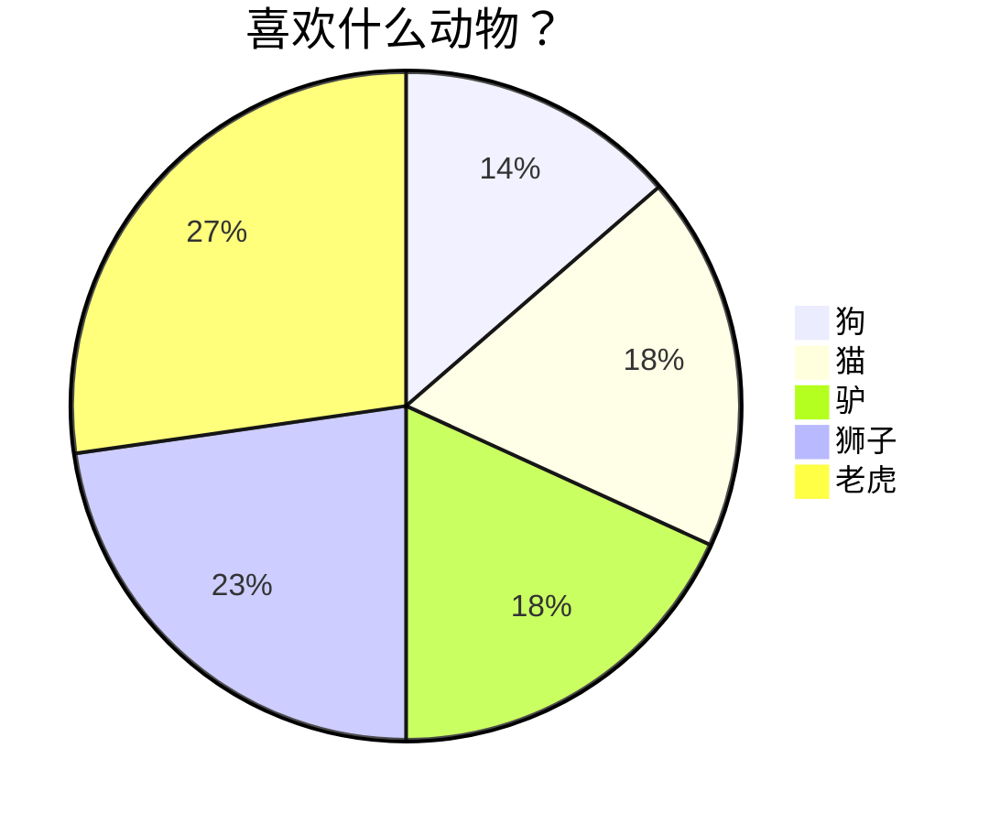

# Mermaid绘图

## 概述

[TOC]

## Mermaid简介

### 什么是Mermaid

Mermaid是一种基于Javascript的绘图工具，使用类似于Markdown的语法，使用户可以方便快捷地通过代码创建图表。

### 项目地址

https://github.com/mermaid-js/mermaid

### 如何使用Mermaid

- 使用特定的Mermaid渲染器；
- **使用集成了Mermaid渲染功能的Markdown编辑器**，使用时，需要将代码块的语言选择为Mermaid。

### Mermaid能绘制哪些图

- 饼状图：使用`pie`关键字，具体用法后文将详细介绍
- 流程图：使用`graph`关键字，具体用法后文将详细介绍
- 序列图：使用`sequenceDiagram`关键字
- 甘特图：使用`gantt`关键字
- 类图：使用`classDiagram`关键字
- 状态图：使用`stateDiagram`关键字
- 用户旅程图：使用`journey`关键字

## 绘图实例

### 饼状图

- 在线渲染器：[Online FlowChart & Diagrams Editor](https://mermaidjs.github.io/mermaid-live-editor/#/edit/eyJjb2RlIjoicGllXG5cIkRvZ3NcIiA6IDQyLjk2XG5cIkNhdHNcIiA6IDUwLjA1XG5cIlJhdHNcIiA6IDEwLjAxIiwibWVybWFpZCI6eyJ0aGVtZSI6ImRlZmF1bHQifX0)（需要梯子）

- 语法
  - 从`pie`关键字开始图表
  - 然后使用`title`关键字及其在字符串中的值，为饼图赋予标题。（这是**可选的**）
  - 数据部分
    - 在`" "`内写上分区名。
    - 分区名后使用`:`作为分隔符
    - 分隔符后写上数值，最多支持2位小数，数据以百分比的形式展示



### 流程图

- 在线渲染器：[Online FlowChart & Diagrams Editor](https://mermaidjs.github.io/mermaid-live-editor/#/edit/eyJjb2RlIjoiZ3JhcGggVERcbiAgICBBW0hhcmRdIC0tPnxUZXh0fCBCKFJvdW5kKVxuICAgIEIgLS0-IEN7RGVjaXNpb259XG4gICAgQyAtLT58T25lfCBEW1Jlc3VsdCAxXVxuICAgIEMgLS0-fFR3b3wgRVtSZXN1bHQgMl0iLCJtZXJtYWlkIjp7InRoZW1lIjoiZGVmYXVsdCJ9fQ)（需要挂梯子）

  - 语法

    - 方向

      用于开头，声明流程图的方向。

      * `graph`或`graph TB`或`graph TD`：从上往下
      * `graph BT`：从下往上
      * `graph LR`：从左往右
      * `graph RL`：从右往左

    - 结点

      - 无名字的结点：直接写内容，此时结点边框为方形；节点内容不能有空格
      - 有名字的结点：节点名后书写内容，内容左右有特定符号，结点边框由符号决定；节点内容可以有空格

      ```mermaid
      graph
          默认方形
          id1[方形]
          id2(圆边矩形)
          id3([体育场形])
          id4[[子程序形]]
          id5[(圆柱形)]
          id6((圆形))
      ```

      ```mermaid
      graph
      	id1{菱形}
      	id2{{六角形}}
      	id3[/平行四边形/]
      	id4[\反向平行四边形\]
      	id5[/梯形\]
      	id6[\反向梯形/]
      ```

    - 连线样式

      - 实线箭头：分为无文本箭头和有文本箭头，有文本箭头有2种书写格式

      ```mermaid
      graph LR
      a-->b--文本1-->c-->|文本2|d
      ```

      - 粗实线箭头：分为无文本箭头和有文本箭头

      ```mermaid
      graph LR
      a==>b==文本==>c
      ```

      - 虚线箭头：分为无文本箭头和有文本箭头

        ```mermaid
        graph LR
        a-.->b-.文本.->c
        ```

      - 无箭头线：即以上三种连线去掉箭头后的形式

      ```mermaid
      graph LR
      a---b
      b--文本1---c
      c---|文本2|d
      d===e
      e==文本3===f
      f-.-g
      g-.文本.-h
      ```

      - 其他连线：需要将`graph`关键字改为`flowchart`，除了新增加的连线形式外，上面三种线的渲染效果也会不同

      ```mermaid
      flowchart LR
          A o--o B
          B <--> C
          C x--x D
          
          旧连线 --文本--> 也会不同
      ```

      - 延长连线：增加相应字符即可，如下图中的B到E，连线中增加了一个`-`。字符可多次添加

      ```MERMAID
      graph LR
          A[Start] --> B{Is it?};
          B -->|Yes| C[OK];
          C --> D[Rethink];
          D --> B;
          B --->|No| E[End];
      ```

      

    - 连线形式
  
         - 直接链接
  
         ```mermaid
         graph LR
            D[Rethink1<br/>Rethink2] -- text --> B -- text2 --> C
         ```
  
         - 多重链接
  
         ```MERMAID
         graph 
            a --> b & c--> d
            
            A & B--> C & D
            
             X --> M
             X --> N
             Y --> M
             Y --> N
         ```
  
    - 其他玩法
  
         - 子图
  
         子图：需要将`graph`关键字改为`flowchart`，在代码段的开始加入`subgraph`，尾部加入`end`
  
         ```mermaid
         flowchart TB
             c1-->a2
             subgraph one
             a1-->a2
             end
             subgraph two
             b1-->b2
             end
             subgraph three
             c1-->c2
             end
             one --> two
             three --> two
             two --> c2
         ```
  
         
  
         - 注释
  
         ​       在行首加入`%%`即可。
  
         ```mermaid
         graph LR
         %%这是一条注释，在渲染图中不可见
             A[Hard edge] -->|Link text| B(Round edge)
             B --> C{Decision}
             C -->|One| D[Result one]
             C -->|Two| E[Result two]
         ```
  
         
  
         
  
    
  
    ​	
