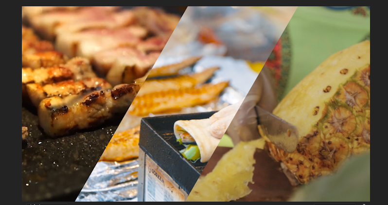

# PR使用手册

## 概述

[TOC]

学习资源：B站GenJi

版本：PR2019

## 入门

### 剪辑步骤

> pr	剪辑软件
>
> au	音频处理
>
> ae	特效
>
> 达芬奇	颜色处理

### 组件

> 整体剪辑视频的窗口

### 预览窗口

> 预览的视频减少分辨率（==减少卡顿==）

### 快捷键

> C	裁剪对象
>
> V 	选择对象
>
> ctrl+m	导出文件
>
> m	标记
>
> shift+m	右移标记点（用于==卡点==）
>
> ctrl+shift+m	左移标记点

### 卡点插件

beat edit

### 镜头语言

>推
>
>拉
>
>摇
>
>移
>
>跟

#### 推入

1. 新建调整图层
2. 转场切点shift+方向键左右（==5帧==）
3. ctrl+k（==切==）
4. 变换（==缩放%50==）
5. 镜像
6. 复制镜像
7. 变换（==缩放%200==）
8. 打关键帧
9. 调节速度曲线
10. alpha调整（==防止alpha穿帮==）
11. 调节快门角度（==取消==合成的快门角度，==增大==快门角度）（目的：实现==动态模糊==）

### 分屏

1. 线性擦除（过渡完成%30，擦除角度120°）
2. 打位置锚点（利用shift+方向键左右，==一帧结束伴随一帧开始==）
3. 锚点设置临时插值（==连续贝塞尔曲线==）

### 轨道遮罩键

1. 给背景套上==轨道遮罩键==
2. 选择PNG格式的镂空视频轨道

## 进阶操作

### 转场

- 恒定功率（音频渐收）

