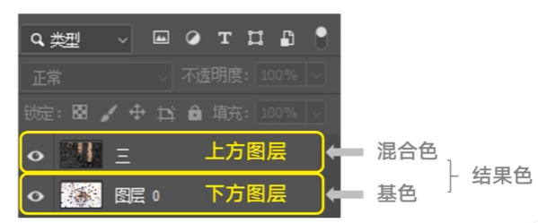
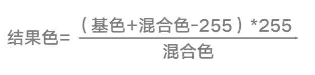
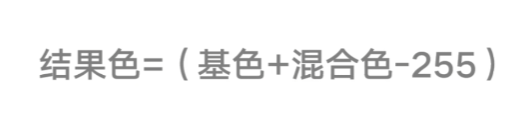
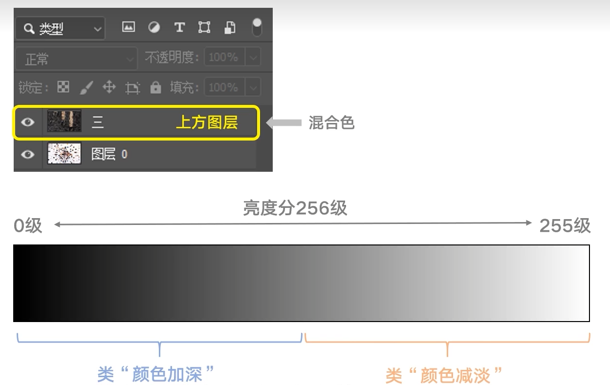
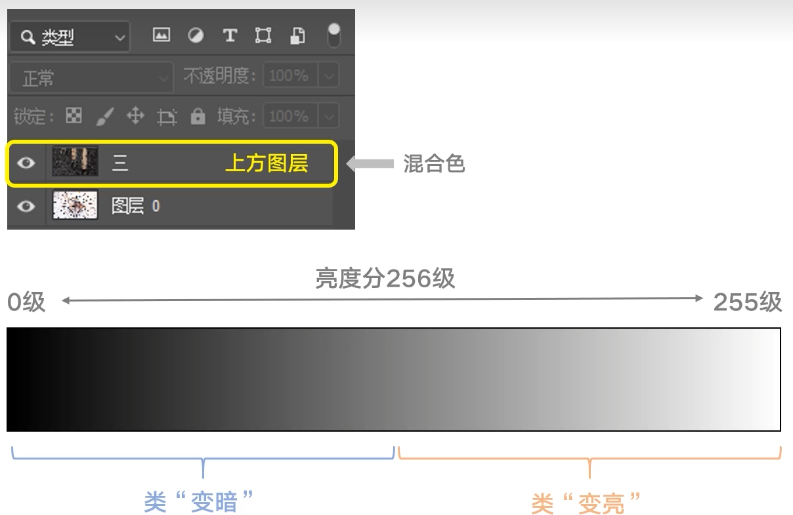
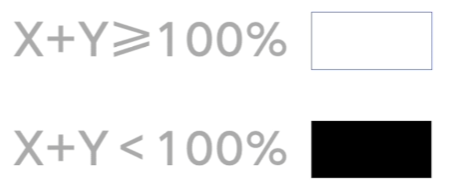
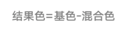
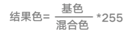

# PS使用手册

## 概述

[TOC]

## 入门

### 混合模式

- 覆盖组

  - 正常	上方图层完全遮住下方图层（利用不透明度）
  - 溶解    打出颗粒

- 去亮组

  - ==变暗==    留下暗的
  - ==正片叠底==    越叠越暗

  

  > 结果为50，变暗
  >
  > 叠纯黑，还是黑
  >
  > 叠纯白，无效

  - 颜色加深

  

  

  > 原来暗的地方，变暗
  >
  > 原来亮的地方，不管他

  - 线性加深

  

  > 过渡比 `颜色加深` 柔和

  - 深色

- 去暗组

  - 变亮

  > 哪个暗留哪个

  - ==滤色==

  > 将整个画面提亮
  >
  > 滤白得白
  >
  > 滤黑无效

  - 颜色减淡

  > 亮的更亮，暗的不管他

  - 线性减淡

  > `颜色减淡` 的线性过渡

- 对比组

  - 叠加

  > 亮的更亮，暗的更暗
  >
  > 取决于基色的亮度

  - 强光

  > 亮的更亮，暗的更暗
  >
  > 取决于混合色的亮度

  - 柔光

  > 取决于混合色的亮度
  >
  > 比%50亮的更亮，比%50暗的更暗
  >
  > 过渡比强光柔和

  - 亮光

  

  - 线性光

  > 比亮光柔和

  - 点光

  

  - 实色混合

  

  > 处理完后，图中只有黑白两个颜色

- 差值组

  - 差值

  

  > 颜色一样，就为黑
  >
  > 主要用于照片堆栈对齐

  - 减去

  

  > 图片大面积变深，用于高低频

  - 划分

  

  > 颜色会变亮

- 色彩组

  - 色相

  > 只改变上方图层的颜色，不改变其饱和度和明度
  >
  > 用于改变衣服颜色，不改变其材质

  - 饱和度
  - 颜色

  > 色相和饱和度 混合出来的
  >
  > 同时改变色相、饱和度，不改变明度

  - 明度

  > 只改变明度，不改变色相和饱和度

