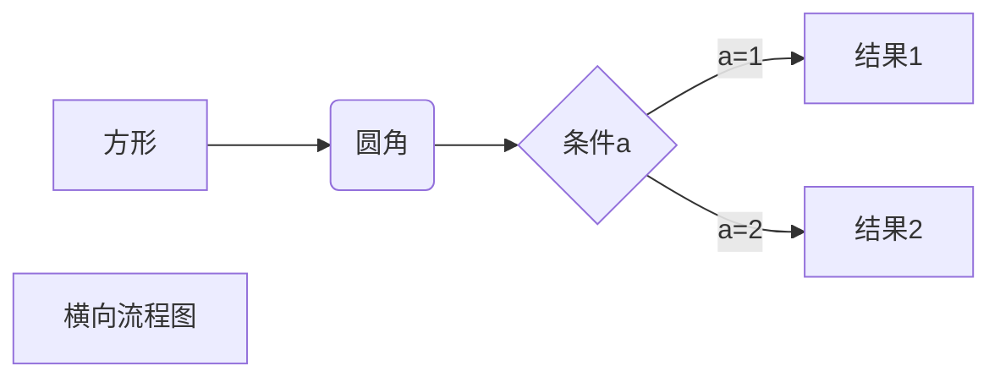
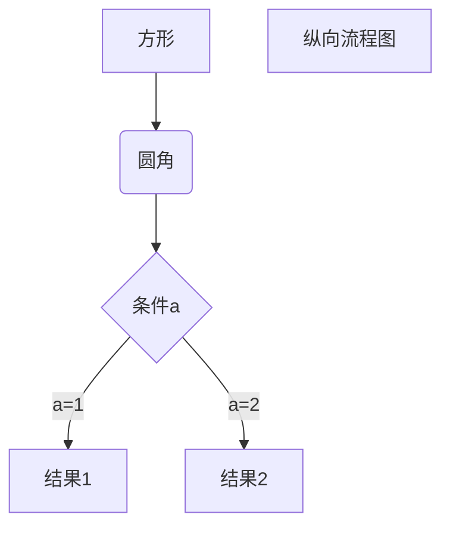

# markdown如何使用

## 概述

[TOC]


## 块元素

### 标题

```
# This is an H1

## This is an H2

###### This is an H6
```

### 引用

```
> 引用
```

### 列表

```
## un-ordered list
*   Red
*   Green
*   Blue

## ordered list
1.  Red
2. 	Green
3.	Blue
```

### 任务列表

```
- [ ] a task list item
- [ ] list syntax required
- [ ] normal **formatting**, @mentions, #1234 refs
- [ ] incomplete
- [x] completed
```

### 代码块

```
```python
```

### 数学公式

```markdown
$$
\mathbf{V}_1 \times \mathbf{V}_2 =  \begin{vmatrix}
\mathbf{i} & \mathbf{j} & \mathbf{k} \\
\frac{\partial X}{\partial u} &  \frac{\partial Y}{\partial u} & 0 \\
\frac{\partial X}{\partial v} &  \frac{\partial Y}{\partial v} & 0 \\
\end{vmatrix}
```

$$
\mathbf{V}_1 \times \mathbf{V}_2 =  \begin{vmatrix}
\mathbf{i} & \mathbf{j} & \mathbf{k} \\
\frac{\partial X}{\partial u} &  \frac{\partial Y}{\partial u} & 0 \\
\frac{\partial X}{\partial v} &  \frac{\partial Y}{\partial v} & 0 \\
\end{vmatrix}
$$

$$
\begin{vmatrix}
\mathbf{V}_1 \times \mathbf{V}_2 =
\end{vmatrix}
$$


$$
\frac{\partial X}{\partial u}
$$

### 表格

```
| First Header  | Second Header |
| ------------- | ------------- |
| Content Cell  | Content Cell  |
| Content Cell  | Content Cell  |
```

| First Header | Second Header |
| ------------ | ------------- |
| Content Cell | Content Cell  |
| Content Cell | Content Cell  |

也可鼠标选择 段落 - 表格 - 插入表格

### 脚注

```
this[^footnote]
```


You can create footnotes like this[^footnote].

[^footnote]: Here is the *text* of the **footnote**.

### 水平线

```
***
或者
---
```

***

---

## 行内元素

### 链接

我和我的[祖国](www.baidu.com "中国")。

### 内部链接

我的[祖国](#脚注)。

### 超链接

This is [an example][id] reference-style link.

[id]: http://www.baidu.com/  "Optional Title Here"

常用方法如下

[百度一下](https://www.baidu.com)。

### URL邮件

```
<163@.COM>
```

<163@.com>

### 强调

```
我的*祖国*

我的_祖国_
```

我的*祖国*

我的_祖国_

### 加粗

```
我的**祖国**
```

我的**祖国**

### 代码

```
这个`P=FV`公式很简单。
```

这个`P=FV`公式很简单。

### 删除线

```
我是个~~胖子~~。
```

我是个~~胖子~~。

### 下划线

```
我是<U>下划线</U>
```

我是<u>下划线</u>

### 表情

```
:smile:
```

:smile:

### 内联数学

```
$\lim_{x \to 0} sin(x) = 0$
```

$\lim_{x \to 0} sin(x) = 0$

### 下标

```
H~2~O
CO~2~
```

H~2~O

CO~2~

X~long\ text~

### 上标

```
X^2^
```

X^2^

### 高亮

```
==高亮==
```

==高亮==

### HTML

```
<span style="color:red">this text is red</span>
```

<span style="color:red">this text is red</span>

### 图片

直接粘贴进去

## 高级玩法--Mermaid

### 横向流程图

````markdown

````


### 纵向流程图

````markdown

````


## 数学公式--Latex

### 普通符号

```markdown
$ \pm \times \div \mid $
```

$ \pm \times \div \mid$

```markdown
$ \cdot \circ \ast \bigodot \bigotimes $
```

$ \cdot \circ \ast \bigodot \bigotimes $

```MACKDOWN
$ \leq \geq \neq \approx \equiv \sum  \prod \coprod$
```

$ \leq \geq \neq \approx \equiv \sum  \prod \coprod$

### 希腊字母

```mackdown
$ \alpha \beta \gamma \Gamma \delta \Delta \epsilon \varepsilon$
```

$ \alpha \beta \gamma \Gamma \delta \Delta \epsilon \varepsilon $

```markdown
$ \zeta \eta \theta \Theta \vartheta \iota \kappa \lambda \Lambda $
```

$ \zeta \eta \theta \Theta \vartheta \iota \kappa \lambda \Lambda $

```markdown
$ \mu \nu \xi \Xi \pi \Pi \varpi \rho \varrho \sigma \Sigma $
```

$ \mu \nu \xi \Xi \pi \Pi \varpi \rho \varrho \sigma \Sigma $

```markdown
$ \varsigma \tau \upsilon \Upsilon \phi \Phi \varphi \chi $
```

$ \varsigma \tau \upsilon \Upsilon \phi \Phi \varphi \chi $

```markdown
$ \psi \Psi \Omega \omega $
```

$ \psi \Psi \Omega \omega$

### 上标

^ 表示上标，如果上标内容多于一个字符，则使用 {} 括起来

```markdown
$ x^{y^z} = (1+e^x)^{-2xy^w} $
```

$ x^{y^z} = (1+e^x)^{-2xy^w}$

### 下标

 _ 表示下标，如果下标内容多于一个字符，则使用 {} 括起来

```markdown
$ H_2 O_{20} $
```

$ H_2 O_{20} $

### 括号

```markdown
 f(x, y) = x^2 + y^2, x \epsilon [0, 100], y \epsilon \{3, 4, 5\}
```

$ f(x, y) = x^2 + y^2, x \epsilon [0, 100], y \epsilon \{3, 4, 5\}$

>  可使用\left和\right加大括号的大小

```markdown
(\frac {x} {y})^2 

\left(\frac {x} {y} \right)^2
```

$(\frac {x} {y})^2  $ 普通括号

$ \left(\frac {x} {y} \right)^2 $ 加大的括号

> \left 和 \right必须成对出现，对于不显示的一边可以使用 . 代替

```markdown
\left. \frac{dy}{dx} \right| _{x=0}
```

$\left. \frac{dy}{dx} \right| _{x=0}$

$\left| \frac{dy}{dx} \right. _{x=0}$

### 分数

使用 *\frac{分子}{分母}*，或者使用 *分子 \over 分母*

```markdown
\frac{1}{2x+1} 
或者
{{1} \over {2x+1}}
```

$\frac{1}{2x+1} $

$ {1} \over {2x+1}$

### 开方

使用 *\sqrt[n]{a}*

```markdown
 \sqrt[3]{9}, \sqrt[2]{9} ,  \sqrt{9}
```

$\sqrt[3]{9}, \sqrt[2]{9},\sqrt{9}$

### 对数

```markdown
\log
\lg
\ln
```

$\log$

$\lg$

$\ln$

### 省略号

有两种省略号，\ldots 表示与文本底线对齐的省略号，\cdots 表示与文本中线对齐的省略号。

\cdot 表示一个点，也就是点乘号

```markdown
f(x_1,x_2,\ldots,x_n) = x_1^2+x_2^2+\cdots+x_n^2
```

$f(x_1,x_2,\ldots,x_n) = x_1^2+x_2^2+\cdots+x_n^2$

### 向量

使用 *\vec{a}*

```markdown
 \vec a \cdot \vec b = 0
```

$ \vec a \cdot \vec b = 0 $

### 极限

```markdown
\lim_{n\rightarrow+\infty}\frac{1}{n(n+1)}
```

$\lim_{n\rightarrow+\infty}\frac{1}{n(n+1)}$

### 累加

```markdown
\sum_1^n\frac{1}{x^2}
```

$\sum_1^n\frac{1}{x^2}$

$S_1^2$

### 累乘

```MARKDONW
\prod_{i=0}^n{1 \over {x^2}}
```

$\prod_{i=0}^n{1 \over {x^2}}$

### 微积分

```markdown
y{\prime}x 
\int 
\iint
\iiint 
\oint 
\lim 
\infty 
\nabla
```

$ y{\prime}x $

$\int$

$ \iint$

$ \iiint $

$ \oint $ 

$\lim $

$ \infty $

$ \nabla $

```MARKDOWN
\int_0^1x^2dx
```

$\int_0^1x^2dx$

### 集合运算

```markdown
\emptyset \in \notin \subset \supset \subseteq \supseteq \bigcap \bigcup \bigvee \bigwedge \biguplus \bigsqcup
```

$\emptyset \in \notin \subset \supset \subseteq $

$\supseteq \bigcap \bigcup \bigvee $

$\bigwedge \biguplus \bigsqcup$

### 三角函数

```markdown
\bot \angle 30^\circ \sin \cos \tan \cot \sec \csc
```

$ \bot \angle 30^ \circ $

$\sin \cos \tan $

$\cot \sec \csc $

### 逻辑运算

```MARKDOWN
\because 
\therefore 
\forall 
\exists
```

$\because $
$\therefore $
$\forall $
$\exists$

### 箭头

```markdown
\uparrow \downarrow \leftarrow \rightarrow \Uparrow \Downarrow \Leftarrow \Rightarrow \longleftarrow \longrightarrow \Longleftarrow \Longrightarrow
```

 $\uparrow \downarrow \leftarrow \rightarrow $

$\Uparrow \Downarrow  \Leftarrow \Rightarrow $

$\longleftarrow \longrightarrow \Longleftarrow \Longrightarrow$

### 连线

```markdown
\overline{a+b+c+d}

\underline{a+b+c+d}

\overbrace{a+\underbrace{b+c}_{1.0}+d}^{2.0}

\hat{y} \check{y} \breve{y}
```

$\overline{a+b+c+d}$

$\underline{a+b+c+d}$

$\overbrace{a+\underbrace{b+c}_{1.0}+d}^{2.0}$

$$\hat{y} \check{y} \breve{y} $$

### 需要转义的字符

```markdown
\# \$ \%\&\_\{\} 
```

$\#   \$   \%   \&    \_  \{   \} $
