# 微机原理

## 概述

[TOC]

### 需要补的知识点

1. 锁存器
2. 三态门

## 微机的基础知识

### 微机和单片机

微机是具有完整运算及控制功能的计算机，包括微处理器（CPU）、存储器、接 口适配器以及输入输出设备、总线系统等。

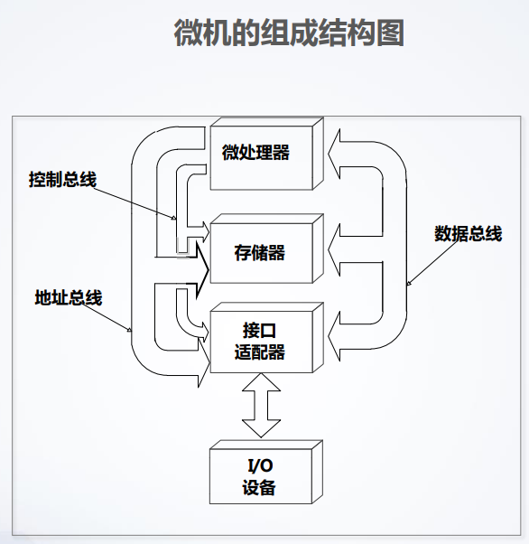

将微处理器、一定容量的RAM和ROM以及I/O口、定时器等电路 集成在一块芯片上，构成单片机

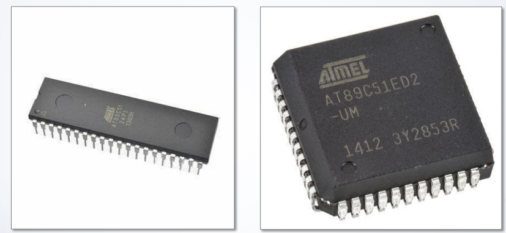

### 微机的组成

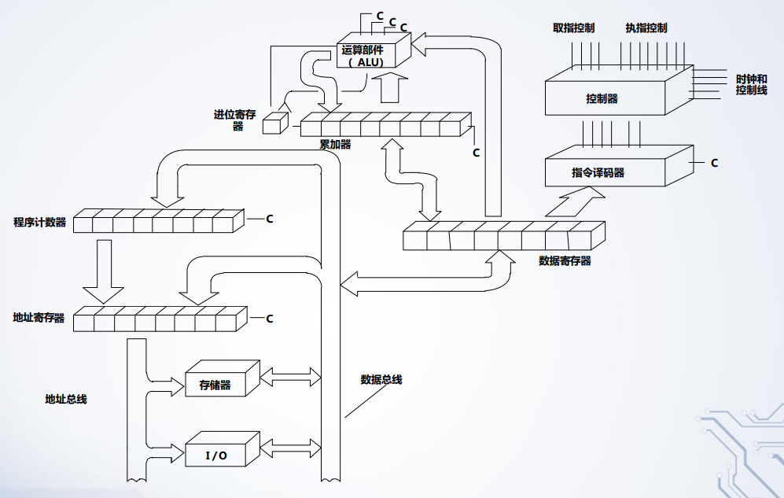

#### 运算器

算术逻辑单元（ALU）、累加器和寄存器等几部分组成。

 ALU的作用：是把传送到微处理器的数据进行算术或逻辑运算。

 ALU具有两个主要的输入来源：一个来自累加器，另一个来自数据寄存器。 

运算器有两个主要的功能：执行各种算术运算；执行各种逻辑运算。

#### 控制器

程序计数器(PC)、指令寄存器（IR）、指令译码器（ID）、 时序发生器和操作控制器等组成。 

控制器的主要功能有： 

- 从内存中取出一条指令，并指出下一条指令在内存中的位置 

- 对指令进行译码或测试，并产生相应的操作控制信号 

- 指挥并控制CPU、内存和输入/输出设备之间数据流动的方向

#### 工作过程

不断的取指、执指，取指、执指，循环往复执行程序的过程。

#### 存储器

##### 读写存储器（RAM）

随机存取存储器，又称数据存储器

- 静态RAM：依靠==触发器==存储每位二进制“0”“1”信息。

- 动态RAM：依靠存储==电容==寄存二进制信息。

##### 只读存储器（ROM）

程序存储器

- 掩膜ROM

掩膜技术，生产时将程序固化在芯片

- PROM 

熔丝断裂型ROM，热熔丝存放01信息，断了就是1，生产时将程序固化在芯片内

- EPROM

可紫外光擦除的ROM

-  E²PROM

可以电擦除

-  Flash

可电擦除，单片机中就是4KB的Flash的ROM

### 进制转换


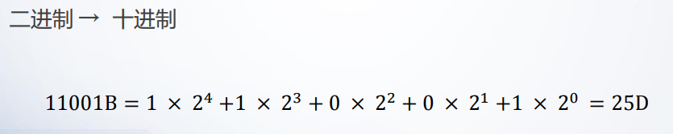

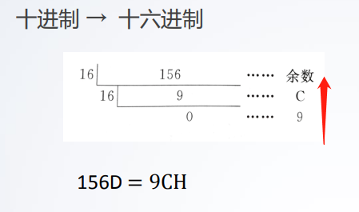

### 计算机常用编码

#### BCD码

又称8421码，超过是进制9的加减法运算，要＋6修正。因为16进制和10进制，进制数相差6

#### ASCII码

7位二进制

### 数据的表示形式

#### 有符号数

最高位是符号位，0正1负

原码

反码

补码

#### 无符号数

没有符号位，全是数据为

#### 小数点表示方法

##### 定点数

##### 浮点数

## 单片机的结构和原理

### MCS-51单片机的结构

每一片单片机包括

1.  一个8位CPU 
2. 片内256字节RAM（128B/256B）
3. 片内4K ROM 
4. 4个8位并行I/O端口P0~P3 
5. 两个或3个16位的定时/计数器  
6. 5个中断源 
7. 一个全双工UART（通用异步收发）串行I/O口 
8.  片内振荡器和时钟产生器

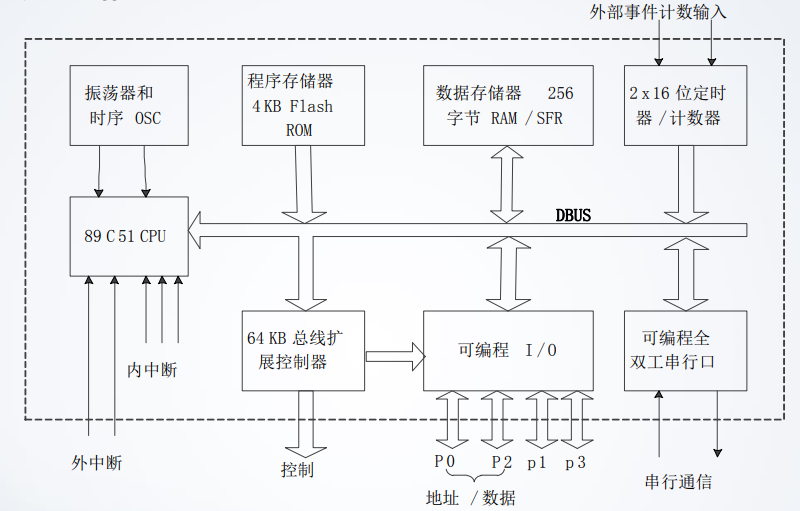

> SFR 特殊功能寄存器

1. 中央处理单元（CPU ） 
   - 运算器 
   - 控制器 
2. 存储器 
   - 程序存储器（ROM ）
   - 数据存储器（RAM ） 
3. I/O接口 四个 8位并行I/O接口P0 ～P3

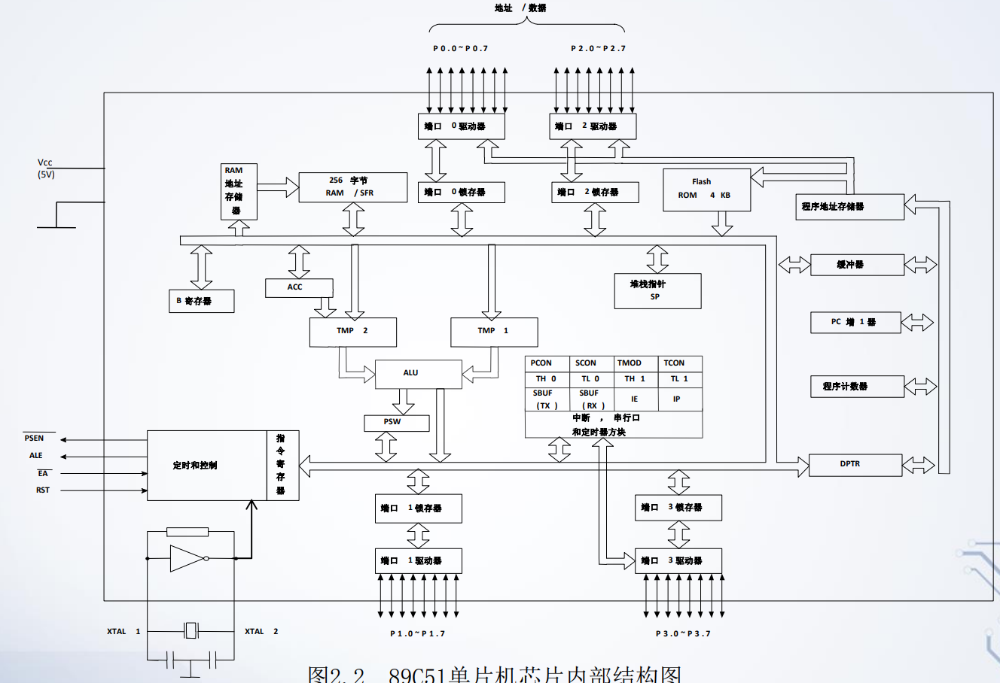

> TMP 暂存器 ： 临时存放数据给ALU
>
> ACC 累加器
>
> B寄存器   乘除法运算
>
> 布尔处理器 处理位操作，以PSW中的CY(C)为其累加器
>
> PSW  程序状态字
>
> IE IP 和中断有关的寄存器
>
> SBUF PCON SCON 和串行口有关的寄存器
>
> TH TL TMOD TCON 和计时器有关的寄存器
>
> 左下角 片内 片外振荡电路

### MCS-51单片机引脚及其功能

双列直插式单片机

- 凹槽左边为1号引脚
- 凹槽右边为40号引脚

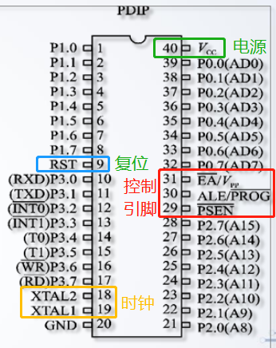

> Vcc 电源引脚 +5伏直流电
>
> Vss 接地引脚

#### 振荡电路

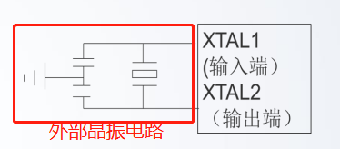

> 外部晶振电路通过XTAL1 XTAL2接到内部时钟，形成振荡回路，产生了晶振频率fosc
>
> fosc输出频率 12MHZ ~ 24MHZ

#### 外接时钟

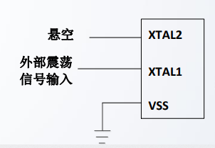

#### CPU时序

- fosc: 振荡频率 0~24MHZ
  - Tosc: 振荡周期
- 时钟周期（机器状态时间 S ）
  - 两倍振荡周期（相位P1，相位P2 ）
- 机器周期：CPU访问存储器一次所需的时间
  - 一个机器周期=12个振荡周期
-  指令周期：CPU执行一条指令所需要的时间
  - 1~4个机器周期

> 振荡周期 =  1 / 𝑓𝑜𝑠𝑐 =  1  / 12 𝑀𝐻𝑧 = 0.0833  𝜇𝑠 
>
> 状态周期 =  2  / 𝑓𝑜𝑠𝑐 =  2  / 12 𝑀𝐻𝑧 = 0.167  𝜇𝑠 
>
> 机器周期 =  12  / 𝑓𝑜𝑠𝑐 =  12 /12 𝑀𝐻𝑧 = 1  𝜇𝑠 
>
> 指令周期 =  1 ~ 4 机器周期 = 1~4  𝜇𝑠

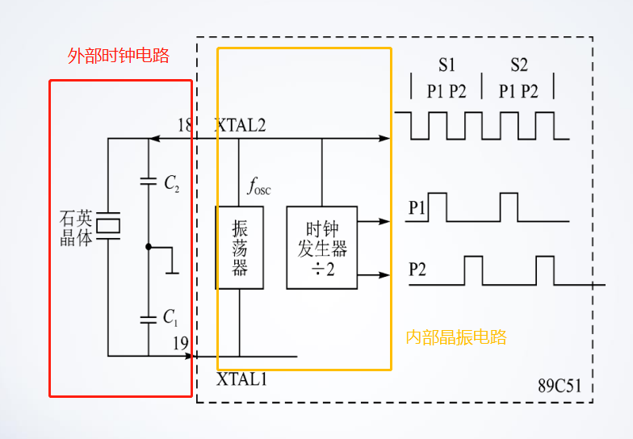

#### 控制引脚

RST / V~pd~ ： 复位引脚，高电平有效

ALE / PROG:

- 不访问片外存储器时
  - 输出正向脉冲信号，频率为1/6 fosc
- 访问片外存储器时
  - ALE接地址锁存器74LS373的G端
    - ALE高：74LS373输出地址
    - ALE高到低：74LS373锁存地址

>当89C51要在片外扩展存储器，要接上一个地址锁存器373，作用是把从P0口的数据和地址分开
>
>从373出来的是8位地址线，数据线从P0口出来

> ALE的作用 接到373的G端，也就是373的时钟引脚端，对373锁存地址进行控制

$\overline{\text{PSEN}}$ ：

- 程序存储允许输出信号端
- 接在EPROM的$\overline{\text{OE}}$ 端

$\overline{\text{EA}}$ / VPP :

- 外部程序存储器地址允许输入端
- 高电平：访问片内EPROM/ROM 
- 低电平：访问片外EPROM/ROM

- 8031 ：$\overline{\text{EA}}$接地 （因为片内没有ROM）

#### I/O引脚

- P0口
  - 通用I/O口
  - 访问片外存储器时，低8位地址/数据
- P1口
  - 通用I/O口
- P2口
  - 通用I/P口
  - 访问片外存储器时  ，高 8位地址
- P3口
  - 通用I/O 口
  - 做控制用，每个引脚功能不同

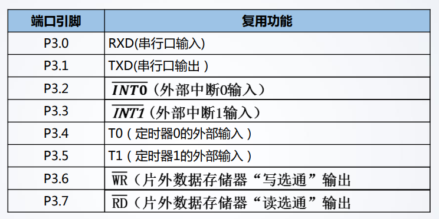

### 存储器分类

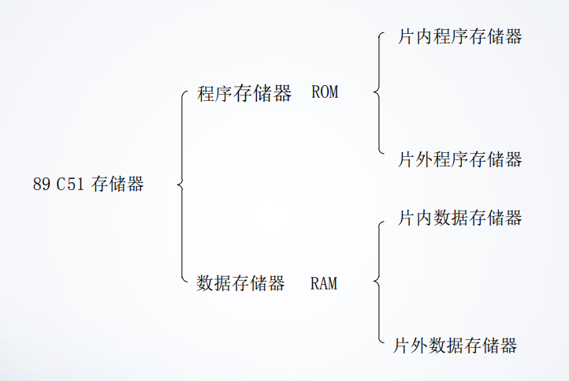


#### 程序存储器地址空间

1. 通过16位程序计数器PC寻址，$\frac{2^{16}}{1024} = 64KB$最大寻址空间64K

2. 程序存储空间片内ROM 4K 0000H~0FFFH 

   程序存储空间片外ROM 64K 0000H~FFFFH

3. $\overline{EA}$接==高==电平，访问片内ROM，$\overline{EA}$接==低==电平，访问片外ROM

4. 8031没有片内ROM，$\overline{EA}$接地

5. 89C51 片内､片外ROM存取速度相等

   $\because$ 访问ROM的指令都是  MOCV

#### 中断矢量地址

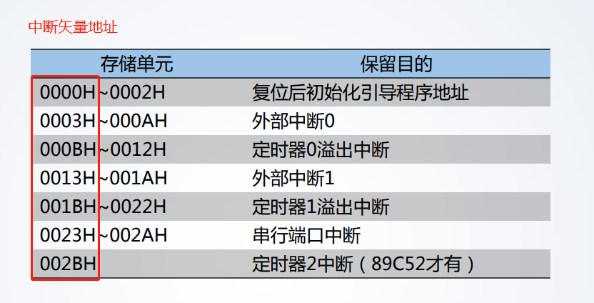

> 0000H是开机后执行的第一条指令，跳转到主程序

> 首地址是中断矢量地址，在该地址下执行转移指令，转移到中断源的中断服务程序，响应中断

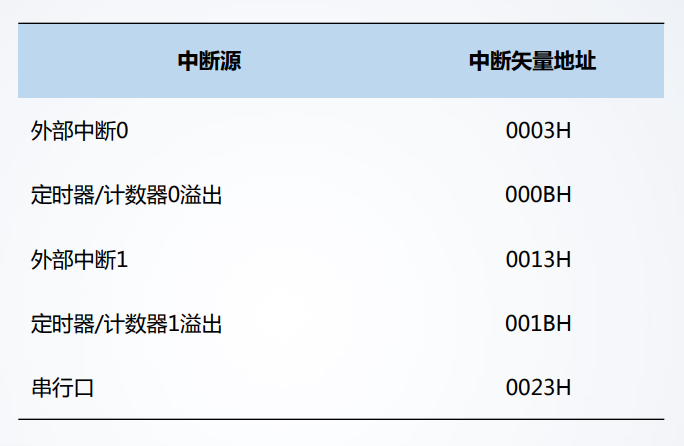

#### 扩展外部ROM

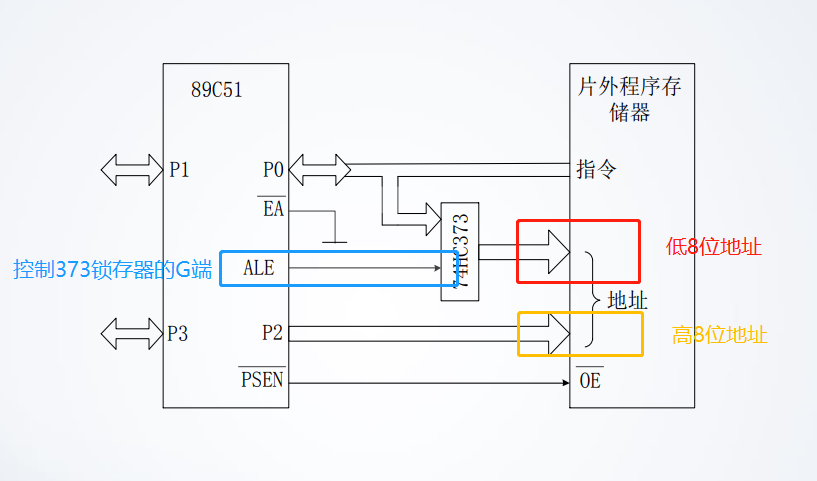

#### 数据存储器地址空间

1. 片外RAM ，64K地址空间，访问指令 MOVX
2. 片内RAM ，256字节地址空间，访问指令MOV

- 低128B（00H~7FH）
  - 四组工作寄存器
  - 位寻址区
  - 用户区
- 高128B（80H~FFH）（SFR特殊功能寄存器）
  - ACC 累加器
  - B 寄存器B
  - PSW 程序状态字
  - SP 栈指针
  - DPTR 数据指针
  - P0~P3 4个并口

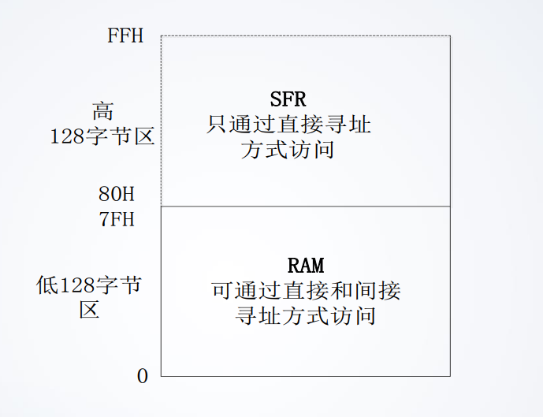

> 4组工作寄存器，一个时刻只有一组能工作

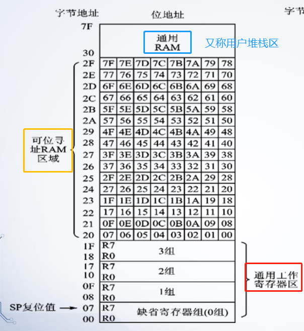

> 高128位可分为 可位寻址 和 不可位寻址

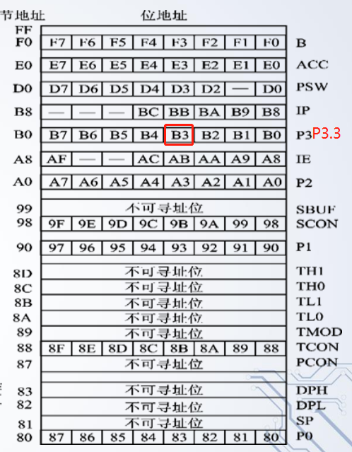

#### 工作寄存器

PSW的RS1 和 RS0 决定哪个工作寄存器工作

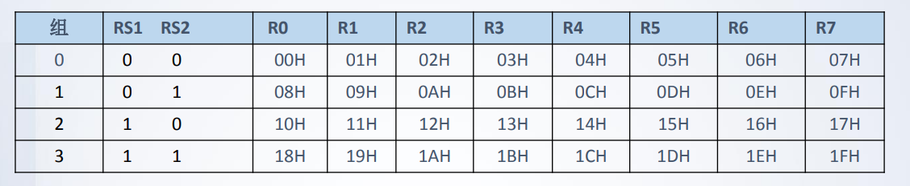

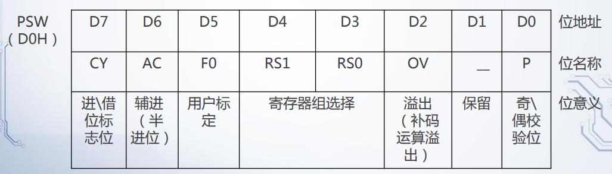

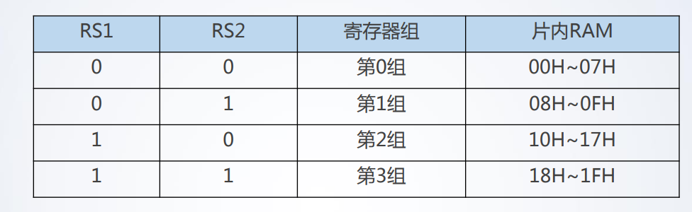

#### 访问外部ROM

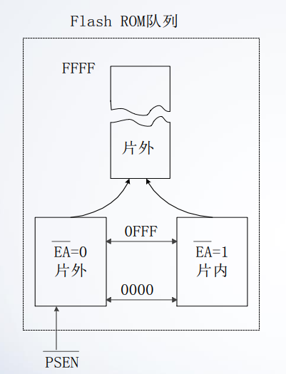

> 片内ROM和片外ROM 有一段地址重合 用$\overline{EA}$控制
>
> $\overline{EA}$ = 0片外
>
> $\overline{EA}$ = 1片内
>
> 访问外部ROM时，$\overline{PSEN}$有效
>
> 访问ROM的指令 MOVC

#### 访问RAM


> 访问片内的指令MOV 访问片外的指令MOVX
>
> 访问片外RAM时，$\overline{RD}$ $\overline{WR}$ 有效

### 输入/输出端口的结构

- 每个输入/输出口占8位

- 每个口包括一个锁存器，一个输出驱动器和输入缓冲器。

  输出数据时可以锁存， 输入数据时可以缓冲。

- 无片外存储器时，每个端口为准双向I/O，

  有片外存储器时，

  - P0口：低八位地址和数据输入/输出
  - P2口：高八位地址

#### P0口某一位的结构

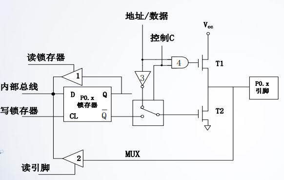

1. P0口作为一般I/O口使用

- P0口用作输出口

  - 一般数据输出
  - 读$\Rightarrow$修改$\Rightarrow$写  ， ANL P0，A; （P0口的数据和累加器A 做 与运算 ，再将结果从P0口输出）

- P0口用作输入口

  - ==端口锁存器==要先写 "1"

    ```markdown
    MOV P0 , #0FF；  //往P0口写1
    MOV A , P0;     //读P0口到累加器A
    ```

    $\because$ 要让三极管T2截止 ，外部信号才能进来

2. P0口作为地址/数据总线使用

#### P1口

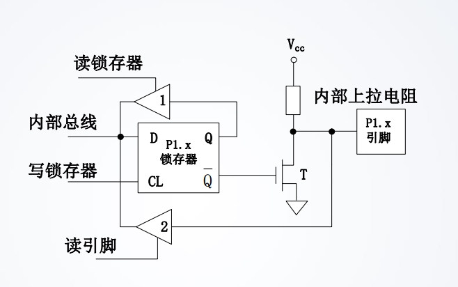

> 没有地址/数据总线

#### P2口


> 访问外部存储器时，要输出高8位的地址，有地址线的功能

#### P3口

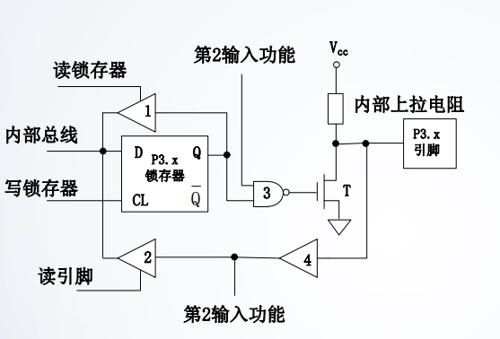

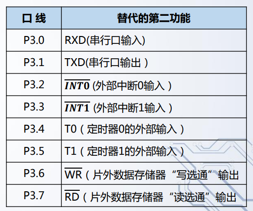

## 定时器

### 定时器概述

1. 两个16位定时/计数器T0 T1，用于定时控制，延时，对外部事件计数和检测。

2. 定时器T0 T1的结构及与CPU的关系

   定时器的组成

   - T0：TH0（8CH），TL0（8AH）
   - T1：TH1（8DH），TL1（8BH）
   - TMOD   TCON


#### 定时工作方式

定时器对8051片内振荡器输出经12分频后的脉冲计数

（即每个机器周期使定时器的数值加一）

> 12分频 ： 把频率除以12 
>
> 对于周期来说 乘以12

若fosc = 12MHZ ， 求计数频率？

计数频率$\frac{12}{12}$ = 1MHZ

$\because$  1个机器周期 = 12个振荡周期

$\therefore$ 每经过1个机器周期，定时器数值+1

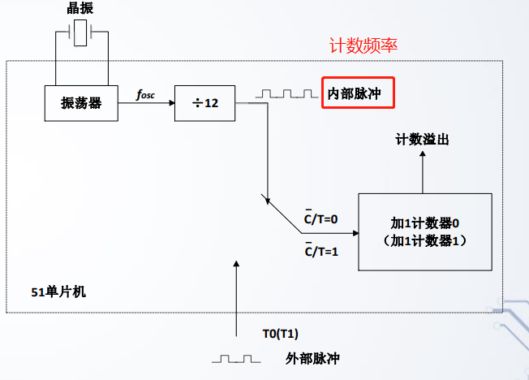

#### 计数工作方式

1. 对外部脉冲计数 ，外部输入的脉冲在负跳变时有效
2. 外部引脚T0(P3.4)  T1(P3.5)

> 汽车轮子转一圈，速度传感器发送一次脉冲，计数器计数，从而算出车速

### 定时器的控制字

1. 工作模式寄存器 TMOD（89H）==不可位寻址==

- M1 M0 操作模式控制位
- C/$\overline{T}$ 计数器方式/定时器方式选择位
- GATE 门控位

2.  控制寄存器 TCON（88H）==可位寻址==

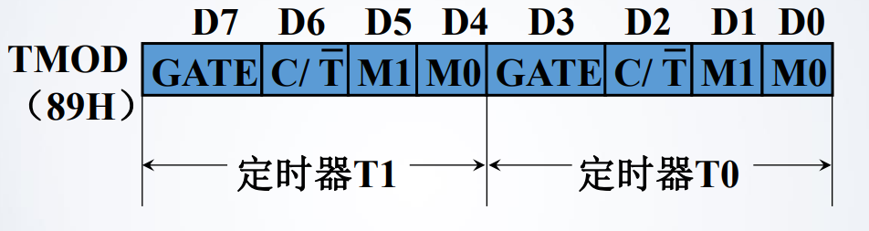

> 低4位控制定时器T0
>
> 高4位控制定时器T1

> C/$\overline{T}$  C:counter    T：timer 
>
> 值为1 计数器   值为0 计时器

> T0的GATE门控位   决定是否受到 INT0 的控制  值为0 不受INT0的控制

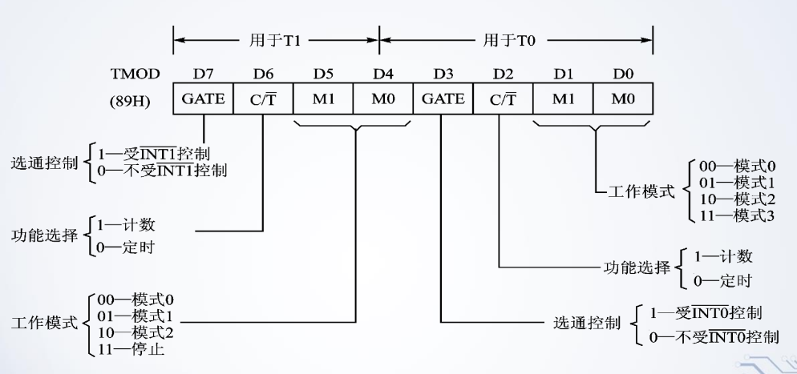

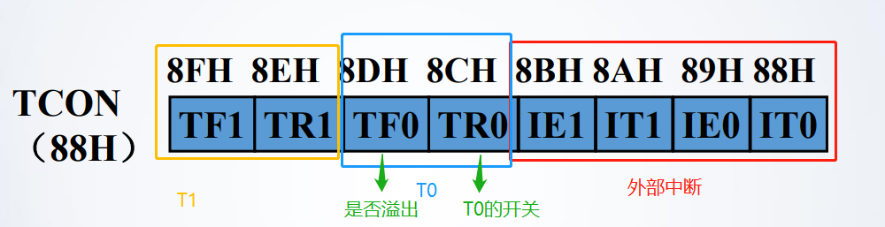

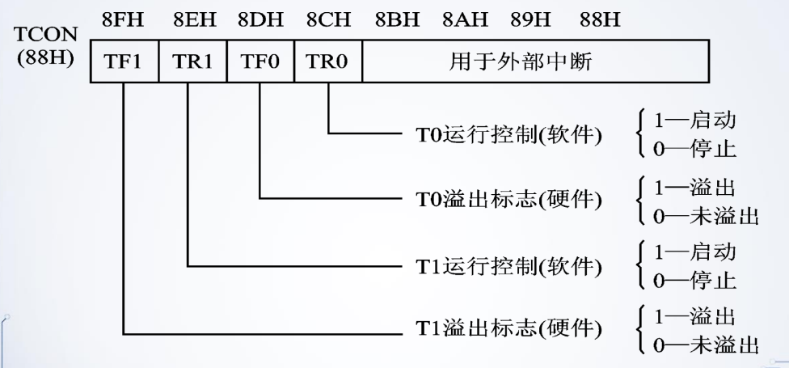

```markdown
setB TR0；  //将TRO置1，开启定时器T0
```

$\because$ TCON ==可位寻址==

$\therefore$ 也可引用8CH 开启 定时器T0

### 定时器的工作模式

1. 模式0

   13位定时器，TL0(5位），TH0(8位）

2. 模式1

   16位定时/记数器

3. 模式2

   可自动重装载的8位定时/计数器

4. 模式3

   - T0：两个独立的8位定时/计数器 

   - T1：无模式3

#### 模式1

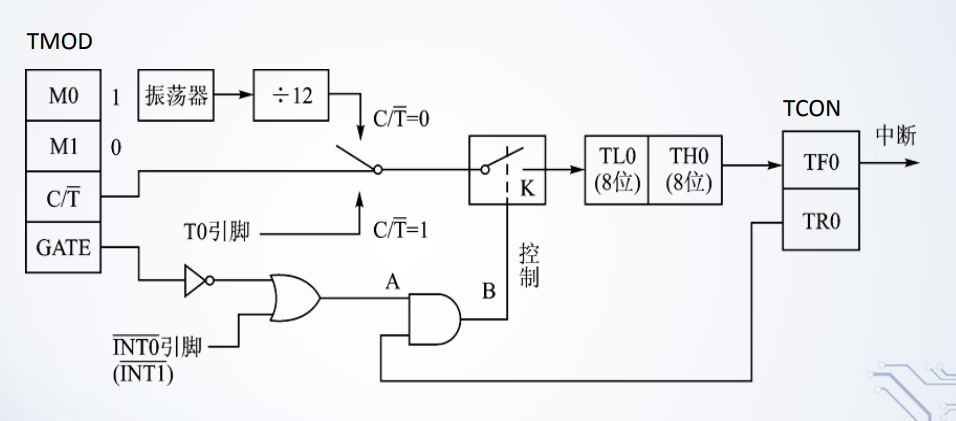

> GATE为0时，定时器只受TR0的影响，与INT0==无关==

> GATE为1时，定时器受==INT0和TR0==共同的影响

**工作特点**

- 该模式对应的是一个16位的定时器/计数器。

- 用于定时工作方式时，定时时间为

  t=($2^{16}$－T0初值)×振荡周期×12

- 用于计数工作方式时，计数长度最大为

  $2^{16}$=65536（个外部脉冲）

- 需要在中断程序重新装入定时常数

#### 模式2

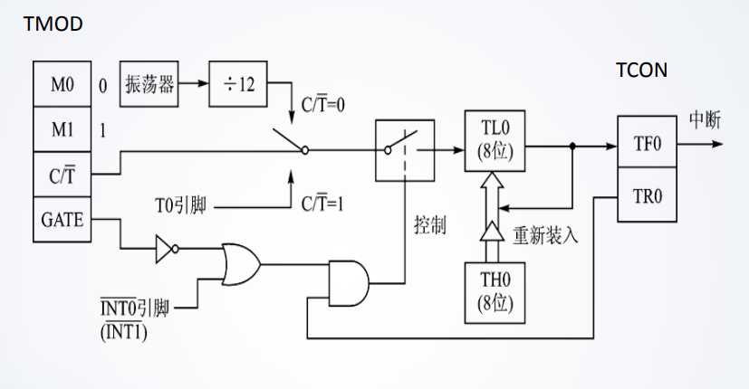

**工作特点**

- 该模式把TL0(TL1)配置成一个可以==自动重装载==的==8位==定时器/计数器，当 TL0(TL1)加满溢出后，TH0(TH1)中的定时常数自动装入TL0(TL1)

- 在程序初始化时，TL0和TH0由软件赋予相同的初值

- 用于定时工作方式时，最大定时时间为

  t=($2^8$－TH0初值)×振荡周期×12

- 用于计数工作方式时，计数长度最大为：$2^8$=256（个外部脉冲）

#### 模式3

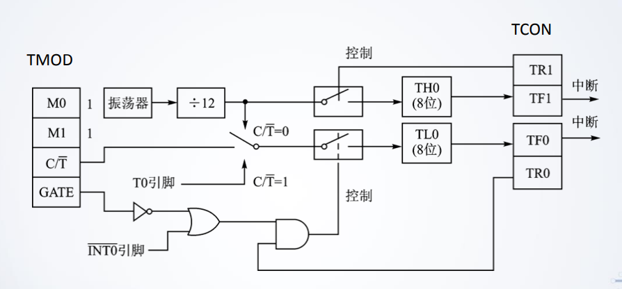

> 原本控制T1的TR1和TF1，在模式3中 控制TH0

> T1除了不能溢出中断，也能正常工作，不断地溢出，适合做波特率发生器

## 中断系统

