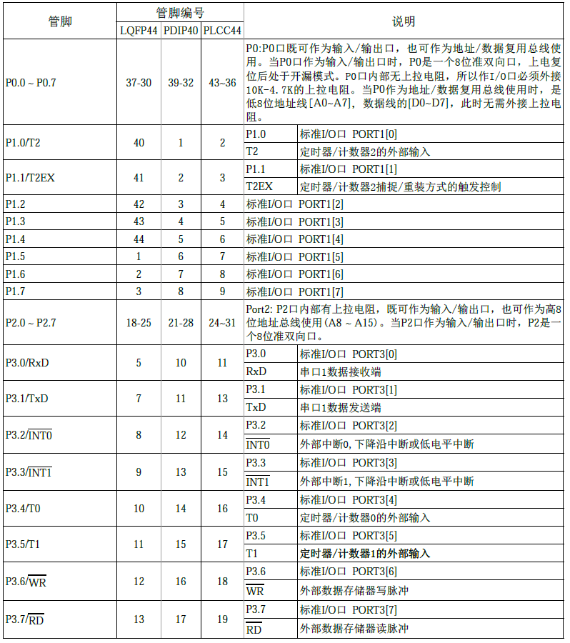
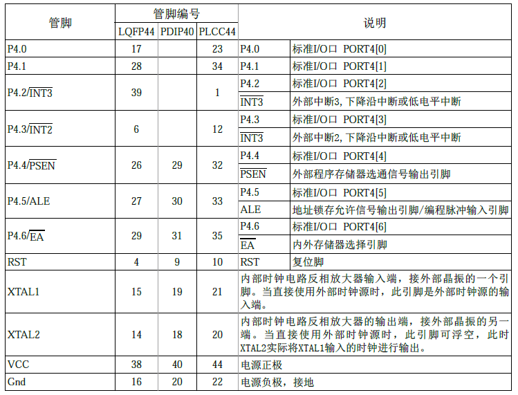

# 普中STC89C52

## 概述

[TOC]

## 学习须知

### 单片机类型

1. 51
2. AVR
3. MSP430
4. STM8
5. STM32
6. DSP
7. LINUX
8. FPGA

### 51开发板模块

1. U6：扩展IO口
2. 红外接收：Nec解码协议
3. NRF24 `3.3V`：无线通信
4. U9：稳压芯片`将5V电压转换成3.3V`
5. CH340`内部自带晶振`：USB转TTL
6. AT24C02：掉电不丢失`存储256字节`
7. 热敏电阻：
8. 复位：
9. DS1302：时钟芯片
10. 电机驱动芯片：引脚带不动电机，须用驱动芯片
11. U5：38译码器
12. U4：74HC25驱动数码管
13. STC89C52：和51没啥区别
14. 时钟晶振：11.0592兆
15. 电位器：调节1602亮度

### 烧录软件

1. PZ-ISP
2. STC-ISP`官方`

## 51单片机简介

### MCU

由CPU,RAM,ROM,输入/输出设备构成

在单片机中这些部件被做到一块集成电路芯片中，所以被称为单片机，又称微控制器MCU

### 51单片机

51单片机是对所有兼容Intel 8031指令系统的单片机的统称

### STC89Cxx芯片

8：8051内核的芯片

9：内部含有flash EEPROM的存储器

80C51中的0：内部含有ROM存储器

87C51中的7：内部含有紫外线可擦除的存储器

C：CMOS

89LV/LE：低电压芯片

89S中的S：可串行下载的flash存储器，在线调试

C51中的5：固定不变

C52中的2：ROM为 2×4kb = 8kb

RC：RAM为512B

RD+：RAM为1280B

40：芯片外部的晶振最多接入40兆

I：工业级温度范围-40~85°

C：商业级0~75°

A：-40~125°

M：-50~150°

封装PDIP：双列直插

2215：22年第15个周

### 引脚

1. 引脚编号逆时针排列
2. LQFP封装小圆点对应1号引脚
3. PDIP封装的凹槽左边为1号引脚
4. PLCC封装的凹槽对应1号引脚

### 引脚说明

#### 按功能分类

1. 电源引脚。如VCC,GND
2. 时钟引脚。如XTAL1
3. 编程控制引脚。如RST、PSEN、ALE
4. I/O口引脚。如P0、P1，有4组8个

