# 电路原理

## 概述

[TOC]

## 电路

### 电路的组成

1. 源（发电厂、光电池、麦克风）
2. 负荷（电动机、扬声器、屏幕）
3. 能量和信号处理电路（变压器、放大器）
4. 导线与开关（输电线路、电路板）

### 如何看待电路

#### 根据负荷性质

#### 根据电源性质

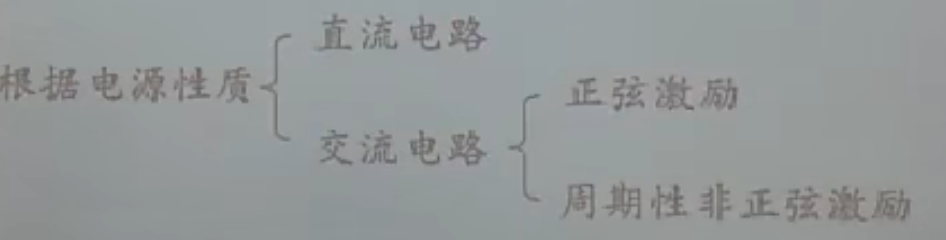

### 电路的变量

#### 电流

#### 电压

#### 电位

#### 电压和电位的关系

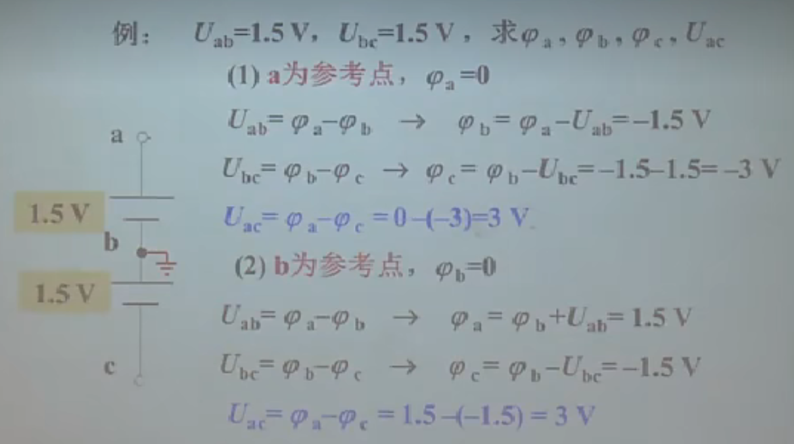

电位取值与参考点有关，无论参考点如何取，两点间电压不变

#### 电动势

#### 变量的大小写

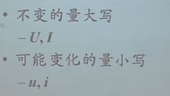

### 电路的参考方向

#### 为什么要参考方向

#### 电流的参考方向

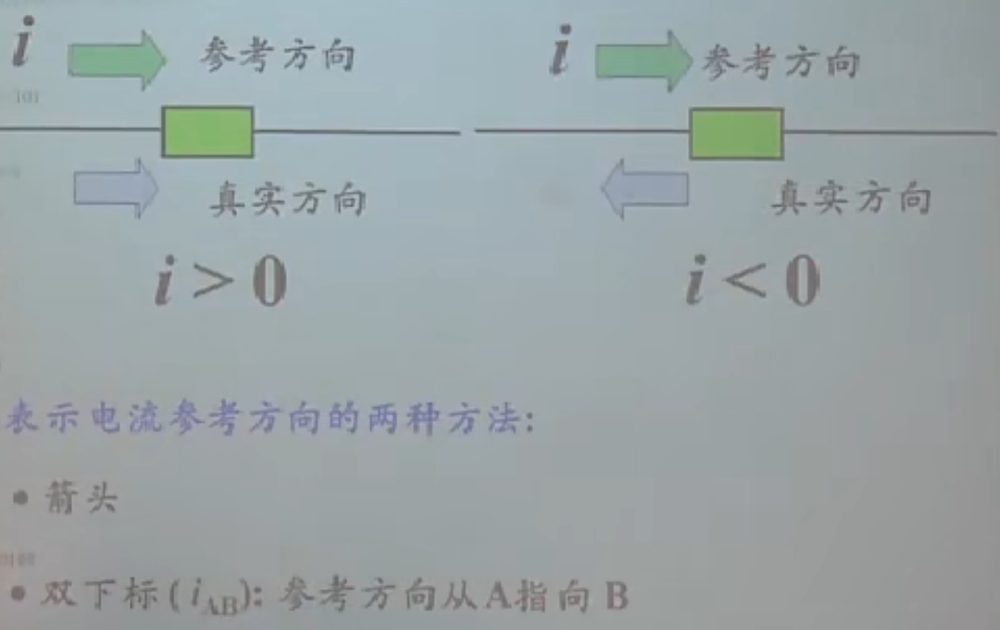

#### 电压的参考方向

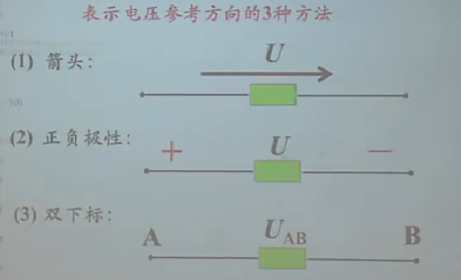

沿着箭头方向，电压下降

沿着箭头方向，电压上升

从+到-，电压（电动势）下降

从A到B，电压（电动势）下降

#### 关联和非关联

电流从电压+流向电压-，关联参考方向

电流从电压-流向电压+，非关联参考方向

### 电路的功率

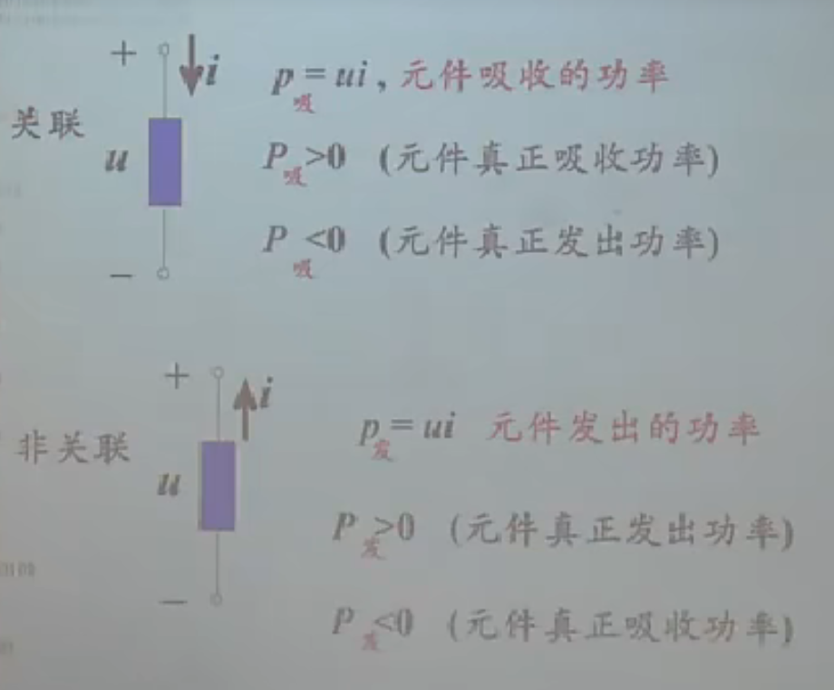

> 如何记忆？ 关联p吸
>
> 电阻永远消耗功率

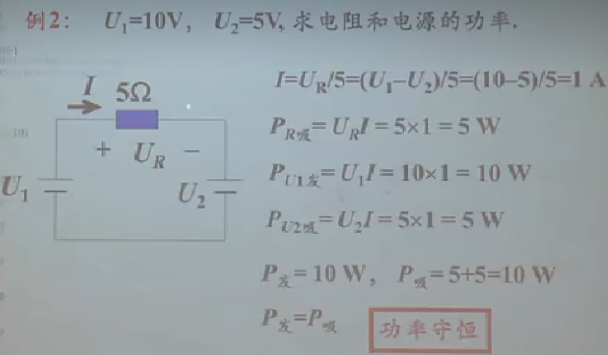

### 电阻器

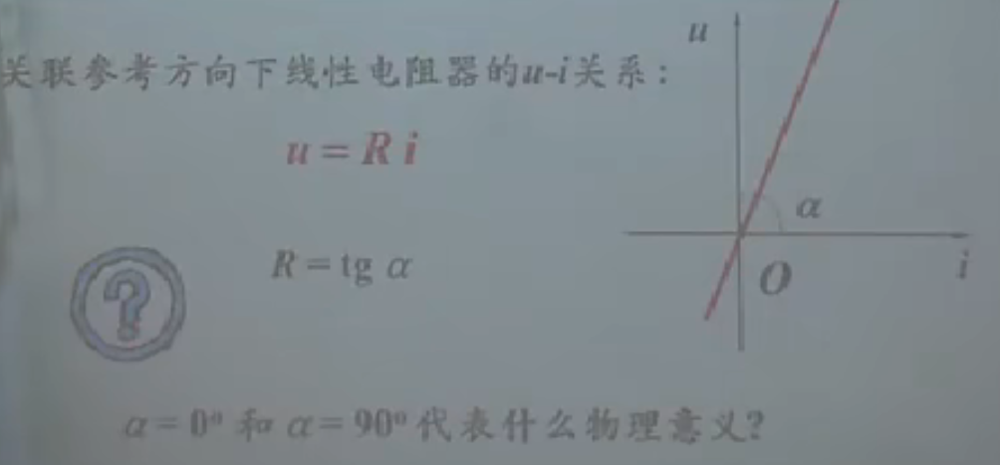

> 电导：促使电流流动
>
> α为0，电阻值为0，短路（理想导线：只导通电流）
>
> α为90.电阻值为∞，断路（开路）

### 独立电源

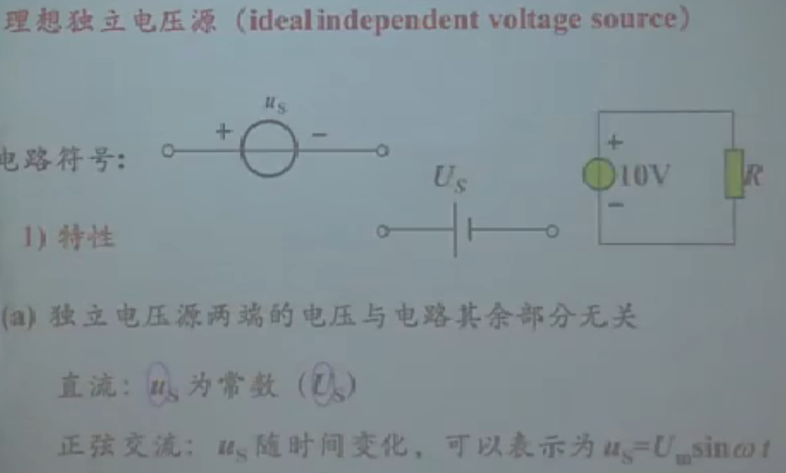

> 当Us=0电压源，等效于电阻为0，短路

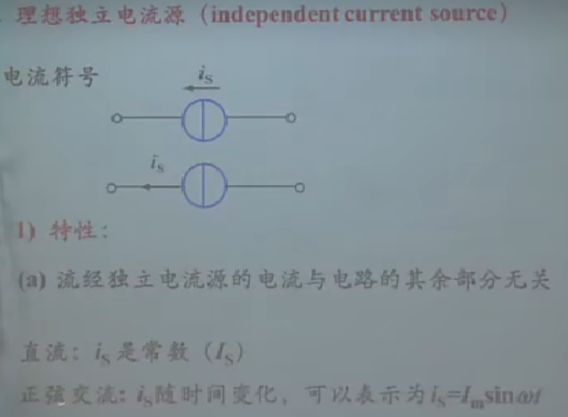

> 电压源上的电流由外电路决定
>
> 电流源上的电压由外电路决定
>
> 当Is=0电流源，等效于电阻为∞，开路

### 独立电源的短路与开路

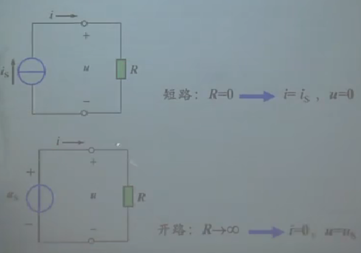

### 实际电源

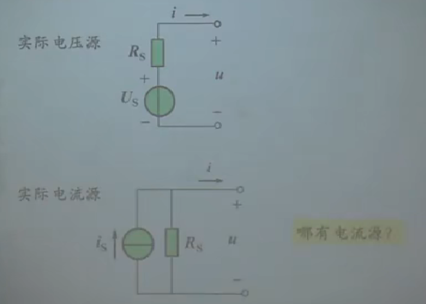

> 实际电压源，有内阻

### 受控元件

#### 受控电阻-开关

又称力控电阻（单刀单掷）

### 端口

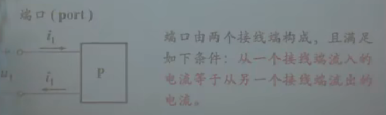

### 压控电阻

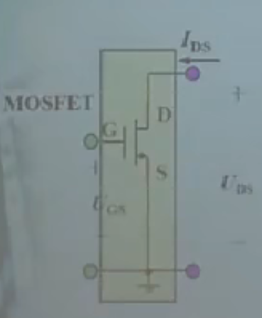

### 受控源

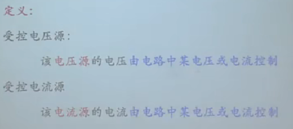

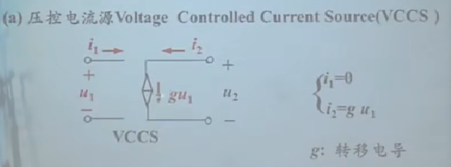

> U=IR, I=U*(1/R)=UG，

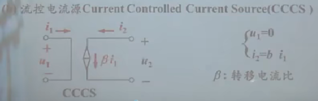

> 输出的是电流，所以β是一个比值

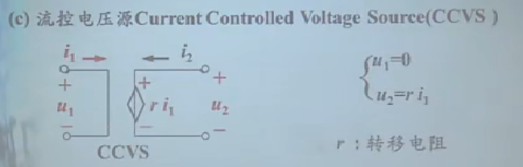

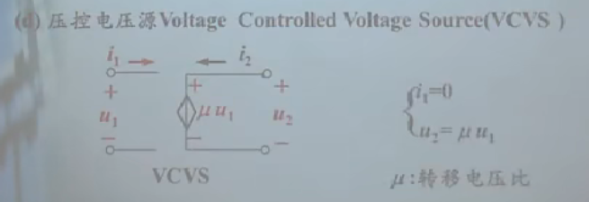

### 基尔霍夫定律

- 支路 一个元器件或几个元器件
- 节点 三条及以上的连接点
- 回路 只经过一次节点 

#### KCL

- 在集总参数电路中，任何时间，对于任一节点，所有流入该节点的电流代数和恒为0

  $\sum$~i入~ = $\sum $~i出~

- 直观节点（绿色） i~1~ -  i~2~ = 2
- 广义节点 （紫色）i~3~ + i~1~ + 2 = i~4~

#### KVL

- 集中参数电路中，任意时刻，对任一回路，所有之路电压降代数和恒为0

$\sum$~u降~ = $\sum $~u升~

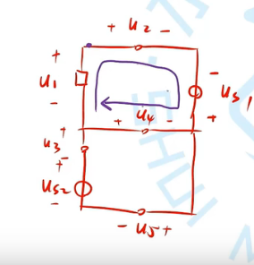

> 顺时针时：U~2~ - U~S1~ - U~4~ -U~1~ = 0

例题：

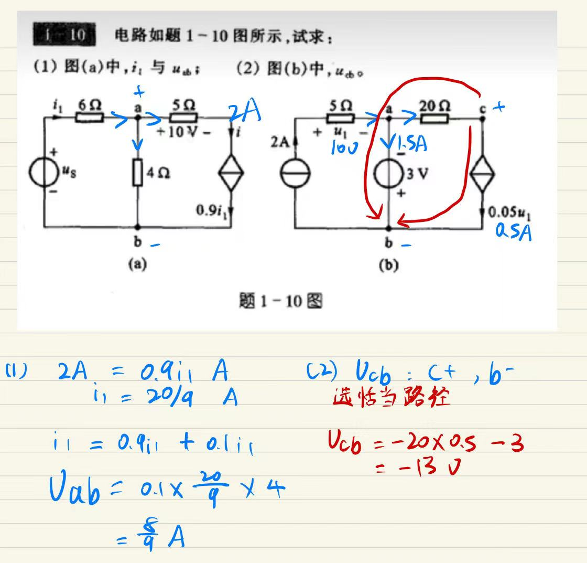

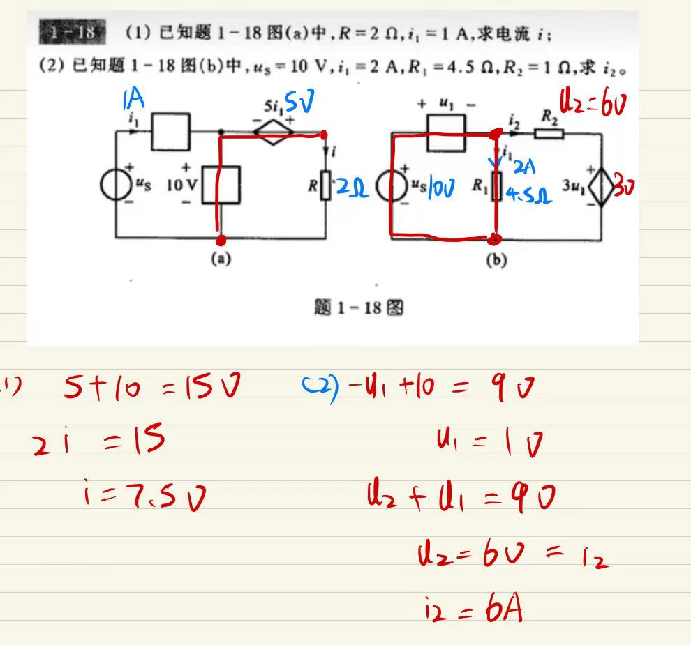

## 电路等效变换

等效电路：用一个结构简单，且与原端口电路具有相同VA特性的电路来替代原电路
