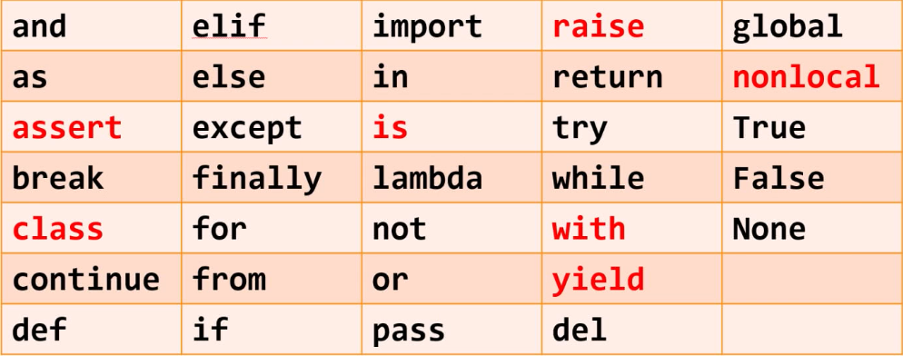
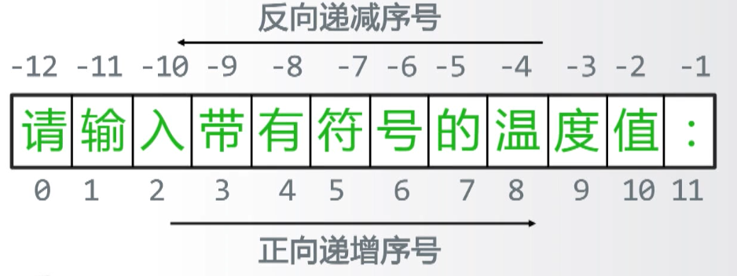

# 北理工python

## 概述

[TOC]

## 初识python

- 根据执行方式不同，编程语言分为两类
  - 静态语言：使用编译执行的编程语言c/c++，java
  - 脚本语言：使用解释执行的编程语言pthon，javascript，php

- 编程步骤
  - 确定IPO
  - 编写程序
  - 调试程序

- 两种编程方式
  - 交互式
  - 文件式

- 温度转换实例

```python
#TempConvert.py
TempStr = input("请输入带有符号的温度值：")
if TempStr[-1] in ['F', 'f']:
    C = (eval(TempStr[0:-1]) - 32) / 1.8
    print("转换后的温度是{:.2f}C".format(C))
elif TempStr[-1] in ['C', 'c']:
    F = 1.8*eval(TempStr[0:-1]) + 32
    print("转换后的温度是{:.2f}F".format(F))
else:
    print("输入有误")
```

### 程序格式框架

#### 缩进

- 严格明确：缩进是语法的一部分
- 所属关系：表达代码间层次关系
- 长度一致：4个空格 或 1个tab

#### 注释

```python
#单行注释 

'''
多行注释
第二行注释
'''
```

#### 变量

用来保存和表示数据的占位符号

#### 命名

变量采用标识符来表示，==关联标识符==的过程叫命名

- 命名规则
  - 大小写字母、数字、下划线、汉字

- 注意事项
  - 大小写敏感
  - 首字符不能是数字
  - 不能与保留字相同

- 保留字



#### 数据类型

- 字符串

  - 由一对单引号或一对双引号

  - 字符串是==有序序列==，序号从0开始

    - 正向递增序号

    - 反向递减序号

    

  - 字符串的使用

    - 索引

  ```python
  TempStr[-1]
  ```

  - ​	切片

  ```python
  TempStr[0:-1]		//从序号0开始，到最后第二个字符
  ```

- 数字类型

  - 整数
  - 浮点数

- 列表类型

由0个或多个数据组成的有序序列

