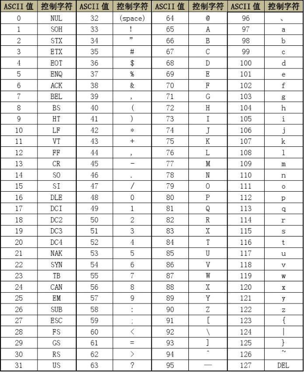

# 鹏哥C语言

## 概述

[TOC]

## 初识C语言

### 数据类型

- 数据类型

```
char        //字符数据类型
short       //短整型
int         //整形
long        //长整型
long long   //更长的整形
float       //单精度浮点数
double      //双精度浮点数
```

- 打印类型

```
%d			//打印整形
%c			//打印字符
%f			//打印单精度浮点数
%lf			//打印双精度浮点数
%p			//打印地址
%x			//打印16进制数字
%o			//打印8进制数字
```

- 数据类型的大小

```c
#include <stdio.h>
#include <stdlib.h>
int main(){

    printf("%d\n",sizeof(char));		//1
    printf("%d\n",sizeof(short));		//2
    printf("%d\n",sizeof(int));			//4 or 8
    printf("%d\n",sizeof(long));		//4
    printf("%d\n",sizeof(long long));	//8
    printf("%d\n",sizeof(float));		//4
    printf("%d\n",sizeof(double));		//8

    system("pause");
    return 0;
}
```

> C语言标准规定：sizeof(long) >= sizeof(int)
>
> 所以有时候long是 4 ，有时候是8

- 为什么出现这么多的类型？

> 来适应各种内存大小，数据范围

- 定义变量的方法

```
int age = 150;
float weight = 45.5f;
char ch = 'w';
```

- 变量的分类
  - 局部变量：定义在代码块（ { } ）内的变量
  - 全局变量

```c
#include <stdio.h>
int global = 2019;//全局变量
int main()
{
    int local = 2018;//局部变量
    //下面定义的global会不会有问题？
    int global = 2020;//局部变量
    printf("global = %d\n", global);
    return 0;
}
```

> 当局部变量和全局变量同名的时候，局部变量优先使用

### 输入语句

```c
#include <stdio.h>
int main()
{
    int num1 = 0;
    int num2 = 0;
    int sum = 0;			//C语言规定： 定义变量只能在当前代码块{}最前面
    printf("输入两个操作数:>");
    scanf("%d %d", &num1, &num2);
    sum = num1 + num2;
    printf("sum = %d\n", sum);
    return 0;
}
```

> scanf是C语言提供的
>
> scanf_s不是标准C语言提供的，是VS编译器提供的，不利于跨平台

### 变量的作用域和生命周期

> 作用域：哪里能用，哪里就是作用域

```c
int main(){
    extern int global_val;		//从别的文件中弄来的变量 声明标识符
    printf("%d",global_val);
    return 0;
}
```

1. 局部变量的作用域是变量所在的局部范围
2. 全局变量的作用域是整个工程

> 生命周期：变量的生命周期是变量的创建到变量的销毁之间的一个时间段

1. 对于局部变量，进入作用域( {} )生命周期开始，出了作用域生命周期结束
2. 全局变量是 整个程序的生命周期

### 常量

- 字面常量

```C
3.14；
```

- const修饰的常变量（常属性）

```C
const int num = 4;  //num本质是变量，只是具有了常属性
```

- #define定义的标识符常量

```c
#define MAX 10
```

- 枚举常量

```C
enum Sex{
    MALE,
    FEMALE,
    SECRET
};
int main(){
    enum Sex s = MALE;
    printf("%d\n",MALE);		//0
    printf("%d\n",FEMALE);		//1
    printf("%d\n",SECRET);		//2
    return 0;
}
```

### 字符串

```C
"hello world\n";
```

这种由双引号（Double Quote）引起来的一串字符称为==字符串字面值==（String Literal），或者简称字符 串。 注：字符串的结束标志是一个 \0 的转义字符。在计算字符串长度的时候 \0 是结束标志，不算作字符串内容。

```C
#include <stdio.h>
//      '\0'的重要性
int main()
{
    char arr1[] = "bit";                   // "bit" = 'b' 'i' 't' '\0'
    char arr2[] = {'b', 'i', 't'};		   //没有斜杠0，直到遇到斜杠0才停止
    char arr3[] = {'b', 'i', 't', '\0'};
    printf("%s\n", arr1);
    printf("%s\n", arr2);
    printf("%s\n", arr3);
    return 0;
}
```

- 字符串长度

```C
#include <stdio.h>
//斜杠0不计算在strlen长度内
int main()
{
    char arr1[] = "bit";   
    char arr2[] = {'b', 'i', 't'};
    char arr3[] = {'b', 'i', 't', '\0'};
    printf("%d\n", strlen(arr1));	//3
    printf("%d\n", strlen(arr2));	//随机值
    printf("%d\n", strlen(arr3));	//3
    return 0;
}
```

### 转义字符

| 转义字符 | 释义                                               |
| -------- | -------------------------------------------------- |
| \?       | 在书写连续多个问号时使用，防止他们被解析成三字母词 |
| \\'      | 用于表示字符常量'                                  |
| \“       | 用于表示一个字符串内部的双引号                     |
| \\\      | 用于表示一个反斜杠，防止它被解释为一个转义序列符。 |
| \a       | 警告字符，蜂鸣                                     |
| \b       | 退格符                                             |
| \f       | 进纸符                                             |
| \n       | 换行                                               |
| \r       | 回车                                               |
| \t       | 水平制表符                                         |
| \v       | 垂直制表符                                         |
| \ddd     | ddd表示1~3个八进制的数字。 如： \130 X             |
| \xdd     | dd表示2个十六进制数字。 如： \x30 0                |

> 早期编译器有`三字母词` [ ??) ]，需要用转义字符

- 字符串长度

```C
printf("%d\n",strlen("c:\test\32\test.c"));		//13 转义字符算一个
```

- 转义字符应用

```c
printf("%c\n",\132);  //八进制132，十进制90，ASSIC码表对应 ‘Z’
```

- ASCII码表



