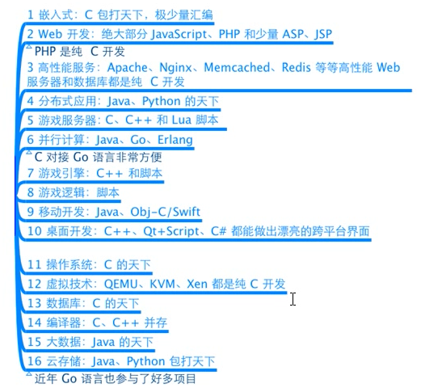
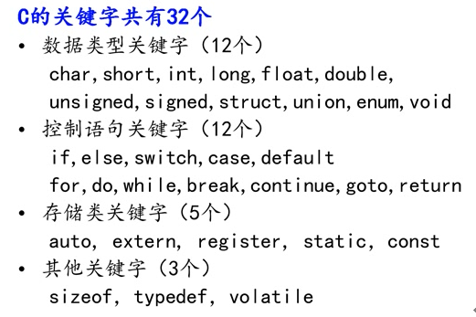
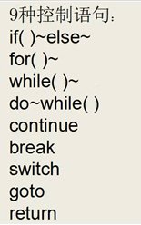
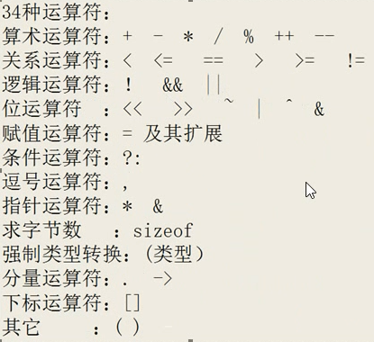
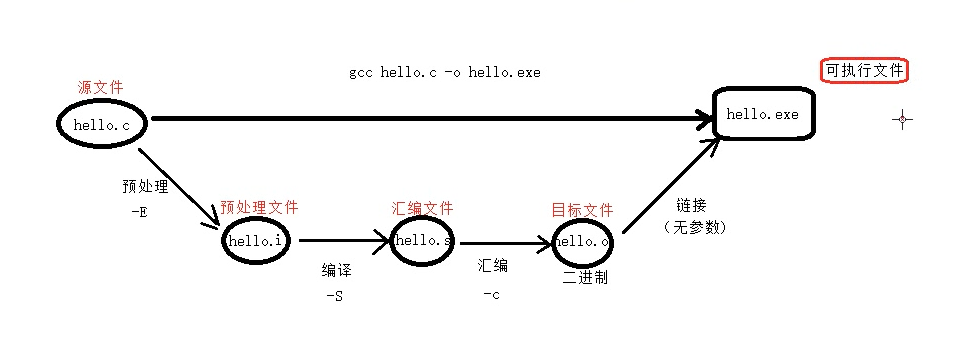
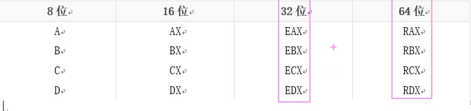
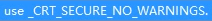

# 黑马C

## 概述

[TOC]

## C语言概述

### C语言应用范围



### 32个关键字



### 9个控制语句



### 34种运算符



### gcc

- （GNU Compiler Collection，GNU 编译器套件），是由 GNU 开发的编程语言编译器

- gcc原本作为GNU操作系统的官方编译器，现已被大多数类Unix操作系统（如Linux、BSD、Mac OS X等）采纳为标准的编译器，gcc同样适用于微软的Windows。

- gcc4步：预处理、编译、汇编、链接



1. 预处理

```cmd
gcc -E xxx.c -o xxx.i
```

- 头文件展开（不检查语法）
- 宏定义替换（宏名替换宏值）
- 替换注释（变成空行）
- 展开条件编译 （根据条件展开指令）

```c
#define X 1
#ifdef X
printf（“666”）；
#endif
```


2. 编译

```cmd
gcc -S xxx.i -o xxx.s
```

- 逐行检查语法错误（==最耗时的过程==）
- 将C程序翻译成汇编指令，得到 .s 的汇编文件


3. 汇编

```c
gcc -c xxx.s -o xxx.o
```

- 将汇编指令翻译成 二进制编码


4. 链接

```c
gcc xxx.o -o xxx.exe
```

- 数据段合并
- 数据地址回填
- 库引入


### 寄存器

CPU总线是64位，寄存器也是64位，向下兼容32位。

在64位的CPU架构上运行64位操作系统，称系统是64位

在64位的CPU架构上运行32位操作系统，称系统是32位

- 寄存器名字




### 注释

单行注释：//

多行注释： /* 注释内容 */


### 函数

- system函数：pause、cmd、mspain、calc、notepad、cls

```C
system("pasue");
```


### C与语言嵌入汇编

```c
#include <stdio.h>
int main(){
    int a;
    int b;
    int c;
    
    __asm
    {
        mov a,3
        mov b,4
        mov eax,a
        add eax,b
        mov c,eax   
    }
    
    printf("%d\n",c);
    return 0;
}
```


## 常用函数积累

### scanf

> 1. 用于存储字符串的空间必须足够大，防止溢出
> 2. 遇到 空格 、\n 终止
> 3. 利用==正则表达式==
>
> ```c
> scanf("%[^\n]s",str);  	//接收除了 \n 之外的数据
> ```


### exit

> 1. 直接退出当前程序
> 2. 在main种可以代替return，在函数中会直接退出程序


## 数据类型

### 常量和变量

- 常量：不会变化的数据

1. "hello"、'A'、-10、3.14

2. #define PI 3.14（==没有；==）

3. const 关键字：被修饰的变量，变为==只读==（不推荐，可以被指针改地址改掉）（又称==只读变量==）

   ```c
   cosnt int a = 10;
   ```

   

- 变量：会变化的数据

1. 变量的定义

```c
int a = 40;
```

2. 声明

```c
int a; 			//没有变量值的变量定义 叫做声明
extern int a;   //利用关键字extern
```

> 变量定义会开辟内存空间，声明变量不会开辟内存空间
>
> 当编译器编译程序时，在变量使用之前，如果没看到变量定义，编译器将变量声明提升为定义
>
> 提升为定义后，不同操作系统给定的默认值不同
>
> 如果有extern关键字，无法提升至定义


- 标识符

1. 变量和常量的统称
2. 命名规则
   1. 常量用大写、变量用小写。大小写严格区分
   2. 只能使用字母、数字、下划线。数字不能开头


### 整型

1. 打印格式

%u			//打印无符号int类型
%d			//打印有符号的10进制数
%hd			//打印有符号short类型
%ld			//打印有符号long类型
%lld		//打印有符号long long类型

%hu			//打印无符号short类型
%lu			//打印无符号long类型
%llu		//打印无符号long long类型

%c			//打印字符
%f			//打印单精度浮点数
%lf			//打印双精度浮点数
%p			//打印地址
%x			//打印16进制数字，字母小写输出
%X			//打印16进制数字，字母大写输出
%o			//打印8进制数字


### sizeof

1. 不是函数
2. 返回值为==size_t== （unsigned int）


### 字符类型char

1. 存储一个字符

​     'A' 、'@'

2. 格式匹配符 %c
3. ==ASCII码==（符号和数字 对应）


### ASCII表

| ASCII值 | 控制字符 | ASCII值 | **字符** | ASCII值 | **字符** | ASCII值 | **字符** |
| :-----: | :------: | :-----: | :------: | :-----: | :------: | :-----: | :------: |
|    0    |   NUT    |   32    | (space)  |   64    |    @     |   96    |    、    |
|    1    |   SOH    |   33    |    !     |   65    |    A     |   97    |    a     |
|    2    |   STX    |   34    |    "     |   66    |    B     |   98    |    b     |
|    3    |   ETX    |   35    |    #     |   67    |    C     |   99    |    c     |
|    4    |   EOT    |   36    |    $     |   68    |    D     |   100   |    d     |
|    5    |   ENQ    |   37    |    %     |   69    |    E     |   101   |    e     |
|    6    |   ACK    |   38    |    &     |   70    |    F     |   102   |    f     |
|    7    |   BEL    |   39    |    ,     |   71    |    G     |   103   |    g     |
|    8    |    BS    |   40    |    (     |   72    |    H     |   104   |    h     |
|    9    |    HT    |   41    |    )     |   73    |    I     |   105   |    i     |
|   10    |    LF    |   42    |    *     |   74    |    J     |   106   |    j     |
|   11    |    VT    |   43    |    +     |   75    |    K     |   107   |    k     |
|   12    |    FF    |   44    |    ,     |   76    |    L     |   108   |    l     |
|   13    |    CR    |   45    |    -     |   77    |    M     |   109   |    m     |
|   14    |    SO    |   46    |    .     |   78    |    N     |   110   |    n     |
|   15    |    SI    |   47    |    /     |   79    |    O     |   111   |    o     |
|   16    |   DLE    |   48    |    0     |   80    |    P     |   112   |    p     |
|   17    |   DCI    |   49    |    1     |   81    |    Q     |   113   |    q     |
|   18    |   DC2    |   50    |    2     |   82    |    R     |   114   |    r     |
|   19    |   DC3    |   51    |    3     |   83    |    S     |   115   |    s     |
|   20    |   DC4    |   52    |    4     |   84    |    T     |   116   |    t     |
|   21    |   NAK    |   53    |    5     |   85    |    U     |   117   |    u     |
|   22    |   SYN    |   54    |    6     |   86    |    V     |   118   |    v     |
|   23    |    TB    |   55    |    7     |   87    |    W     |   119   |    w     |
|   24    |   CAN    |   56    |    8     |   88    |    X     |   120   |    x     |
|   25    |    EM    |   57    |    9     |   89    |    Y     |   121   |    y     |
|   26    |   SUB    |   58    |    :     |   90    |    Z     |   122   |    z     |
|   27    |   ESC    |   59    |    ;     |   91    |    [     |   123   |    {     |
|   28    |    FS    |   60    |    <     |   92    |    /     |   124   |    \|    |
|   29    |    GS    |   61    |    =     |   93    |    ]     |   125   |    }     |
|   30    |    RS    |   62    |    >     |   94    |    ^     |   126   |    `     |
|   31    |    US    |   63    |    ?     |   95    |    _     |   127   |   DEL    |


### 实型（浮点型）

float：单精度浮点型（保留6位小数）

double：双精度浮点型

> 小数4.456（默认double类型）
>
> 4.456f（float类型）
>
> %.3f（保留3位小数，对第四位四舍五入）
>
> %08.3f（保留3位小数，==所有符号==加起来占8个位置，不足的位置用0补齐）

> 科学计数法：3.2e3f = 3.2 * 10^3^ = 3200


### 进制转换


### 原码反码补码

计算机采用==补码==的形式存储数据

43 - 27 ==》 43 + （-27）补码形式计算

> 规定 1000 0000 表示 -128 的==原码反码补码==
>
> 圆盘先对称 再少一个-0 最后倒过来


### 类型限定符

| **限定符** | **含义**                                                     |
| ---------- | ------------------------------------------------------------ |
| extern     | 声明一个变量，extern声明的变量没有建立存储空间。             |
| const      | 定义一个常量，常量的值不能修改。                             |
| Volatile   | 防止编译器优化代码  ;例如，小灯灭亮灭亮灭 被优化为 一个灭的状态 |
| register   | 定义寄存器变量，提高效率。register是建议型的指令，而不是命令型的指令，如果CPU有空闲寄存器，那么register就生效，如果没有空闲寄存器，那么register无效。 |


### 字符串

双引号内的一串字符

结束标记 ==\0==

打印字符串%s，找到==\0==才停止


### putchar函数

输出一个字符到屏幕

直接使用ASCII码

常用来打印换行

```c
putchar('abc');
//结果时b把a覆盖，c把b覆，最后为c
```


### scanf

1. VS2019怕用户输入的数据超出范围，导致丢失，报错



> 宏定义==最好放在第一行==

> ```c
> #pragma warning(disable:4996)  		//让编译器不要报错
> ```

2. 碰到 空格 和 换行 会自动终止

> 不能用scanf接收 ==带有空格的字符串==（用正则表达式可以）


### getchar函数

获取用户输入的一个字符

直接使用ASCII码


## 运算符和表达式

### 运算符分类

| **运算符类型** | **作用**                               |
| :------------: | :------------------------------------- |
|   算术运算符   | 用于处理四则运算                       |
|   赋值运算符   | 用于将表达式的值赋给变量               |
|   比较运算符   | 用于表达式的比较，并返回一个真值或假值 |
|   逻辑运算符   | 用于根据表达式的值返回真值或假值       |
|    位运算符    | 用于处理数据的位运算                   |
|  sizeof运算符  | 用于求字节数长度                       |


### 算术运算符

| **运算符** |  **术语**  |  **示例**   | **结果**  |
| :--------: | :--------: | :---------: | :-------: |
|     +      |    正号    |     +3      |     3     |
|     -      |    负号    |     -3      |    -3     |
|     +      |     加     |   10 + 5    |    15     |
|     -      |     减     |   10 - 5    |     5     |
|     *      |     乘     |   10 * 5    |    50     |
|     /      |     除     |   10 / 5    |     2     |
|     %      | 取模(取余) |   10 % 3    |     1     |
|     ++     |  前缀自增  | a=2; b=++a; | a=3; b=3; |
|     ++     |  后缀自增  | a=2; b=a++; | a=3; b=2; |
|     --     |  前缀自减  | a=2; b=--a; | a=1; b=1; |
|     --     |  后缀自减  | a=2; b=a--; | a=1; b=2; |


### 赋值运算符

| **运算符** | **术语** |  **示例**  | **结果**  |
| :--------: | :------: | :--------: | :-------: |
|     =      |   赋值   | a=2; b=3;  | a=2; b=3; |
|     +=     |  加等于  | a=0; a+=2; |   a=2;    |
|     -=     |  减等于  | a=5; a-=3; |   a=2;    |
|     *=     |  乘等于  | a=2; a*=2; |   a=4;    |
|     /=     |  除等于  | a=4; a/=2; |   a=2;    |
|     %=     |  模等于  | a=3; a%2;  |   a=1;    |


### 比较运算符

C语言中，真用'1',  假用'0'

| **运算符** | **术语** | **示例** | **结果** |
| :--------: | :------: | :------: | :------: |
|     ==     |  相等于  |  4 == 3  |    0     |
|     !=     |  不等于  |  4 != 3  |    1     |
|     <      |   小于   |  4 < 3   |    0     |
|     >      |   大于   |  4 > 3   |    1     |
|     <=     | 小于等于 |  4 <= 3  |    0     |
|     >=     | 大于等于 |  4 >= 1  |    1     |


### 逻辑运算符

| **运算符** | **术语** | **示例** |                         **结果**                         |
| :--------: | :------: | :------: | :------------------------------------------------------: |
|     !      |    非    |    !a    |       如果a为假，则!a为真；  如果a为真，则!a为假。       |
|     &&     |    与    |  a && b  |          如果a和b都为真，则结果为真，否则为假。          |
|    \|\|    |    或    | a \|\| b | 如果a和b有一个为真，则结果为真，二者都为假时，结果为假。 |

> C语言中，&&是 短路与,||是短路或。（java是逻辑或，逻辑与）
>
> ```c
> int i = 0, a = 0, b = 2, c = 3;
> i = a++ && ++b && c++;
> printf("a =%d\n b =%d\n c =%d\n d =%d\n", a, b, c); //1 2 3
> ```
>
> &&结合方向，从左到右，左边为假，右边不用判断，所以b、c不变

> ```c
> a = 0, b = 2, c = 3;
> i = a++||++b||c++;
> printf(" a = %d\n b = %d\n d = %d\n", a, b, d);//1 3 3
> ```
>
> ||结合方向，从左到右，左边为真，右边不用判断，所以c=3


### 运算符优先级

| **优先级** | **运算符** |  **名称或含义**  |        **使用形式**        | **结合方向** |  **说明**  |
| :--------: | :--------: | :--------------: | :------------------------: | :----------: | :--------: |
|   **1**    |    [ ]     |     数组下标     |     数组名[常量表达式]     |    左到右    |            |
|            |    ( )     |      圆括号      |  (表达式）/函数名(形参表)  |      --      |            |
|            |     .      | 成员选择（对象） |        对象.成员名         |      --      |            |
|            |     ->     | 成员选择（指针） |      对象指针->成员名      |      --      |            |
|   **2**    |     -      |    负号运算符    |          -表达式           |    右到左    | 单目运算符 |
|            |     ~      |  按位取反运算符  |          ~表达式           |              |            |
|            |     ++     |    自增运算符    |     ++变量名/变量名++      |              |            |
|            |     --     |    自减运算符    |     --变量名/变量名--      |              |            |
|            |     *      |    取值运算符    |         *指针变量          |              |            |
|            |     &      |   取地址运算符   |          &变量名           |              |            |
|            |     !      |   逻辑非运算符   |          !表达式           |              |            |
|            |   (类型)   |   强制类型转换   |      (数据类型)表达式      |      --      |            |
|            |   sizeof   |    长度运算符    |       sizeof(表达式)       |      --      |            |
|   **3**    |     /      |        除        |       表达式/表达式        |    左到右    | 双目运算符 |
|            |     *      |        乘        |       表达式*表达式        |              |            |
|            |     %      |   余数（取模）   |   整型表达式%整型表达式    |              |            |
|   **4**    |     +      |        加        |       表达式+表达式        |    左到右    | 双目运算符 |
|            |     -      |        减        |       表达式-表达式        |              |            |
|   **5**    |     <<     |       左移       |        变量<<表达式        |    左到右    | 双目运算符 |
|            |     >>     |       右移       |        变量>>表达式        |              |            |
|   **6**    |     >      |       大于       |       表达式>表达式        |    左到右    | 双目运算符 |
|            |     >=     |     大于等于     |       表达式>=表达式       |              |            |
|            |     <      |       小于       |       表达式<表达式        |              |            |
|            |     <=     |     小于等于     |       表达式<=表达式       |              |            |
|   **7**    |     ==     |       等于       |       表达式==表达式       |    左到右    | 双目运算符 |
|            |     !=     |      不等于      |      表达式!= 表达式       |              |            |
|   **8**    |     &      |      按位与      |       表达式&表达式        |    左到右    | 双目运算符 |
|   **9**    |     ^      |     按位异或     |       表达式^表达式        |    左到右    | 双目运算符 |
|   **10**   |     \|     |      按位或      |       表达式\|表达式       |    左到右    | 双目运算符 |
|   **11**   |     &&     |      逻辑与      |       表达式&&表达式       |    左到右    | 双目运算符 |
|   **12**   |    \|\|    |      逻辑或      |      表达式\|\|表达式      |    左到右    | 双目运算符 |
|   **13**   |     ?:     |    条件运算符    | 表达式1?  表达式2: 表达式3 |    右到左    | 三目运算符 |
|   **14**   |     =      |    赋值运算符    |        变量=表达式         |    右到左    |     --     |
|            |     /=     |     除后赋值     |        变量/=表达式        |      --      |            |
|            |     *=     |     乘后赋值     |        变量*=表达式        |      --      |            |
|            |     %=     |    取模后赋值    |        变量%=表达式        |      --      |            |
|            |     +=     |     加后赋值     |        变量+=表达式        |      --      |            |
|            |     -=     |     减后赋值     |        变量-=表达式        |      --      |            |
|            |    <<=     |    左移后赋值    |       变量<<=表达式        |      --      |            |
|            |    >>=     |    右移后赋值    |       变量>>=表达式        |      --      |            |
|            |     &=     |   按位与后赋值   |        变量&=表达式        |      --      |            |
|            |     ^=     |  按位异或后赋值  |        变量^=表达式        |      --      |            |
|            |    \|=     |   按位或后赋值   |       变量\|=表达式        |      --      |            |
|   **15**   |     ，     |    逗号运算符    |       表达式,表达式        |    左到右    |            |


### 类型转换

- 隐式类型转换

1. 编译器自动完成
2. 由赋值产生的类型转换


> 类型转换的原则:
>
> 占用内存字节数少(值域小)的类型，向占用内存字节数多(值域大)的类型转换，以保证精度不降低。


```c
int r = 3;
float s = 3.14 * r * r; //左值float类型， 右值double类型
						//会不会丢失数据，取决于数据范围
```


- 强制类型转换

大多数用于形参给实参传值


## 程序流程结构

### 选择结构

#### if分支

```C
#include <stdio.h>
int main(){
    int a = 5;
    if( a > 5 )
    {
        printf("a>5\n");
    }
    else if( a < 2 )
    {
        printf("a<2\n");
    }
    else
    {
        printf("not find");
    }
    return 0;
}
```


#### switch分支

```c
#include <stdio.h>
int main(){
    int score;
    scanf("%d",&score);
    
    switch(score / 10)
    {
        case 10:
            printf("excellent");
            break; 
        case 9:
            printf("excellent");
            break;
        case 8:
            printf("good");
            break;
        default:
            printf("bad");
            break;        
    }
    return 0;
}
```

> case穿透：
>
> 没有break，会向下穿透继续执行


### 循环结构

#### while循环

```c
#include <stdio.h>
int main(){
    int score;
    scanf("%d",&score);
    while(score < 60)
    {
        printf("低于60不给毕业\n");
    	scanf("%d",&score);
    }
    return 0;
}
```


#### do while循环

```c
#include <stdio.h>
int main(){
    int a = 0;
    do
    {
        a++;

    }while(a > 10);
    return 0;
}
```


#### for循环

```C
#include <stdio.h>
int main(){
    //求1-100的和
    int i = 0;		//循环因子
    int sum = 0;
	for(i = 1; i <= 100; i++)
    {
        sum = sum + i;
    }
    return 0;
}
```

> 1. 循环因子可以定义在for结构内
> 2. for的3个表达式可以省略，但2个分号（；）不能省略


### 跳转语句

#### break

> 1. 跳出一重循环
> 2. 防止case穿透


#### continue

> 1. 结束本次循环


#### goto

```C
#include <stdio.h>
int main(){
	printf("1");
    printf("2");
TOP:
    printf("3");
    printf("4");
    printf("5");
    goto TOP;
    return 0;
}
```

> 1. 设置标签
> 2. 利用 goto关键字


## 数组和字符串

### 一维数组

4种定义数组的方法

```c
//定义一个数组，同时初始化所有成员变量
int a[10] = { 1, 2, 3, 4, 5, 6, 7, 8, 9, 10 };

//初始化前三个成员，后面所有元素都设置为0
int a[10] = { 1, 2, 3 };

//所有的成员都设置为0
int a[10] = { 0 };
	
//[]中不定义元素个数，定义时必须初始化
int a[] = { 1, 2, 3, 4, 5 };

```


### 二维数组

- 初始化

```C
//常规初始化
int arr[3][5] = { {1, 2, 3, 4, 5},{2, 4, 6, 8, 10},{1,1,1,1,1}};

//不完全初始化,默认为0
int arr[3][5] = { {1, 2},{2, 4, 8, 10},{1,1,1,1,1}};

//初始化全0的二维数组
int arr[3][5] = {0}；
    
//系统自动分配行列
int arr[3][5] = {1,2,3,4,5,6,7,8,9,10,21};

//只能省略行值，不能省略列值
int arr[][3] = {1,2,3,4,5};
```


### 多维数组

```c
//2层2行2列
int arr[2][2][2] = {{1，2，3，4}，{5，6，7，8}}，
    			   {{1，2，3，4}，{5，6，7，8}} ;		
```


### 字符数组、字符串

- 异同

```c
char str[6] = {'h', 'e', 'l', 'l', 'o'，'\0'};
//等同于
char str[] = "hello"; //自动补 \0
```


- 处理字符串的函数

1. gets()

> char * gets(char * s);
>
> 从键盘获取一个字符串，返回字符串的首地址。==可以获取带有空格==的字符串。
>
> 参数：用来存储字符串的空间地址
>
> 返回值：返回实际获取到的字符串首地址

```c
char str[100];
printf("%s\n",gets(str));
//获取一个字符串，返回字符串的首地址
//字符串可以带空格
//如果str空间太小，存储的数据会部分丢失
```


2. fgets()

> char * fgets(char * s, int size, FILE * stream);
>
> 从stdin获取一个字符串，==预留\0==的存储空间。
>
> 参数1：用来存储字符串的空间地址
>
> 参数2：描述空间的大小
>
> 参数3：读取字符串的位置
>
> 返回值：返回实际获取到的字符串首地址

```c
char str[100];
printf("%s\n",fgets(str, sizeof(str), stdin));
//预留 \0 的存储空间
//空间足够会读 \n ， 不足则舍弃
 
```


3. puts()

> int puts( const char * s);
>
> 将一个字符串输出到屏幕，==自动添加换行符==（专门写出到屏幕，所以需要换行）
>
> 参数：待写出到屏幕的字符串
>
> 返回值：失败返回 -1 ， 成功返回 非负数


4. fputs()

> int fputs(const char * str, FILE * stream);
>
> 将一个字符串输出到屏幕，==不会自动添加换行符==
>
> 参数1：待写出到屏幕的字符串
>
> 参数2：写出位置 stdout
>
> 返回值：失败返回 -1 ， 成功返回 非负数


5. strlen()

> size_t strlen(const char * s);
>
> 获取字符串的有效长度，==不包含\0== ，到\0就必须结束 strlen（"hello\0world"）==>  5
>
> 参数1：待求长度的字符串
>
> 返回值：有效的字符个数


## 函数

### 函数的分类

- 系统函数，即库函数

- 用户定义函数

### 函数的作用

> 1. 提高代码的复用性
> 2. 提高程序模块化

### 函数的定义

>  函数原型包含
>
> 1. 返回值类型
> 2. 函数名
> 3. 形参列表

> 函数体包含
>
> 1. 一对大括号
> 2. 代码块

> 函数调用包括
>
> 1. 函数名
> 2. 实参列表

### 函数声明

> 函数调用之前，编译没有见过函数定义，就需要函数声明

> 编译器自动隐式声明：返回值为int，补全函数名和形参列表（==不要依赖==）

### 多文件联编

> 将多个含有不同函数功能的 .c 文件模块，编译到一起，生产一个 .exe 文件

> 防止头文件重复包含
>
> 1. #pragma once （只导入一次）-----在windows种
> 2. #ifndef \_\_HEAD_H__
>
> ​      #define  \_\_HEAD_H__
>
> ​		头文件内容......（函数声明、include头文件、类型定义、宏定义）
>
> ​		#endif


### 字符函数

### strlen

> size_t strlen ( const char * str );
>
> 参数1：指向的字符串必须要以 '\0' 结束
>
> 返回值：size_t，是无符号的


> 模拟实现
>
> 方式1：
>
> ```C
> //计数器方式
> int my_strlen(const char * str)
> {
>  	int count = 0;
>  	while(*str)
> 	{
>  		count++;
>  		str++;
>  	}
>      return count;
> }
> ```
>
>  方式2：
>
> ```C
> //不能创建临时变量计数器
> int my_strlen(const char * str)
> {
>      if(*str == '\0')
>      	return 0;
>      else
>      	return 1 + my_strlen(str+1);
> }
> ```
>
> 方式3：
>
> ```c
> //指针 - 指针 的方式
> int my_strlen(char *s)
> {
>        char *p = s;
>        while(*p != ‘\0’ )
>               p++;
>        return p-s;
> }
> 
> ```


### strcpy

> char* strcpy(char * destination, const char * source );
>
> - 源字符串必须以 '\0' 结束。 
> - 会将源字符串中的 '\0' 拷贝到目标空间。 
> - 目标空间必须足够大，以确保能存放源字符串。 
> - 目标空间必须可变。

> 模拟实现
>
> ```C
> //1.参数顺序
> //2.函数的功能，停止条件
> //3.assert
> //4.const修饰指针
> //5.函数返回值
> //6.题目出自《高质量C/C++编程》书籍最后的试题部分
> char *my_strcpy(char *dest, const char*src)
> { 
> 	 char *ret = dest;
> 	 assert(dest != NULL);
>  	 assert(src != NULL);
>  
>      while((*dest++ = *src++)) //src的字符放到dest，当src为\0时，dest赋为0，并退出while
>      {
>            ;
>      }
>      return ret;
> }
> ```


### strcat

> char * strcat ( char * destination, const char * source );
>
> - 源字符串必须以 '\0' 结束。 
> - 目标空间必须有足够的大，能容纳下源字符串的内容。
> -  目标空间必须可修改。


> 模拟实现
>
> ```c
> char *my_strcat(char *dest, const char*src)
> {
> 	 char *ret = dest;
> 	 assert(dest != NULL);
>  	 assert(src != NULL);
> 	 while(*dest)
> 	 {
>  		dest++;
> 	 }
> 	 while((*dest++ = *src++)) //简洁的代码，src后的\0也赋值给了dest
>  	 {
> 	      ;
> 	 }
> 	 return ret;
> }
> 
> ```


### strcmp

> int strcmp ( const char * str1, const char * str2 );
>
> - 第一个字符串大于第二个字符串，则返回大于0的数字 
> - 第一个字符串等于第二个字符串，则返回0 
> - 第一个字符串小于第二个字符串，则返回小于0的数字

> 模拟实现
>
> ```c
> int my_strcmp (const char * src, const char * dest)
> {
>         assert(src != NULL);
>         assert(dest != NULL);
>         while( *src == *dest)
>         {
>             if(*dst == '\0')
>                 return 0;
>             ++src;
>             ++dest;
>         }
> 
>         if (*src > *dest)
>             return 1;
>         else
>         	return -1 ;
> }
> ```
>
> 

### strncpy

> char * strncpy ( char * destination, const char * source, size_t num );
>
> - 拷贝num个字符从源字符串到目标空间。 
> - 如果源字符串的长度小于num，则拷贝完源字符串之后，在目标的后边追加0，直到num个。


### strncat

> char * strncat ( char * destination, const char * source, size_t num );
>
> - sou按num个字符拼接到des


### strstr

> char * strstr ( const char *str1, const char * str2);
>
> - 查找字符串 ：在str1中 找 第一次出现 str2 字符串的 地址
> - KMP算法

> 模拟实现
>
> ```c
> char * my_strstr (const char * str1, const char * str2)
> {   
>     assert(str1 != NULL);
>     assert(str2 != NULL);
>     char *s1;
>     char *s2;
>     char *cur = str1;
>     if ( *s2 == '\0')     
>         return s1;
>     while (*cur)
>     {
>         s1 = cur;
>         s2 = str2;
>         while ( (*s1 != '\0') && (*s2 != '\0') && (*s1 == *s2) ) {
>             s1++;
>             s2++;
>         }
>         if(*s2 == '\0')
>             return cur;
>   		cur++;
>     }
>     return NULL;
> }
> ```
>
> 

### strtok

> char * strtok ( char * str, const char * sep );
>
> - sep参数是个字符串，定义了用作分隔符的字符集合 
> - 第一个参数指定一个字符串，它包含了0个或者多个由sep字符串中一个或者多个分隔符分割的标记。
> - strtok函数找到str中的下一个标记，并将其用 \0 结尾，返回一个指向这个标记的指针。（注： strtok函数会改变被操作的字符串，所以在使用strtok函数切分的字符串一般都是==临时拷贝的内容==并且可修改。） 
> - strtok函数的第一个参数不为 NULL ，函数将找到str中第一个标记，strtok函数将保存它在字符串 中的位置。
> - strtok函数的第一个参数为 NULL ，函数将在==同一个字符串中==被保存的位置开始，查找下一个标 记。 如果字符串中不存在更多的标记，则返回 NULL 指针。
> - 如果字符串中不存在更多的标记，则返回 NULL 指针。


### strerror

> char * strerror ( int errnum );
>
> - 返回错误码，所对应的错误信息。
> - strerror(errno)   errno是全局的错误码 头文件errno.h


## 内存函数

### memcpy

> void * memcpy ( void * destination, const void * source, size_t num );
>
> - num是字节数
> - 函数memcpy从source的位置开始向后复制num个字节的数据到destination的内存位置。
> -  这个函数在遇到 '\0' 的时候并不会停下来。
> -  如果source和destination有任何的重叠，复制的结果都是未定义的。
> - ==不能有重叠==

> 模拟实现
>
> ```c
> void * my_memcpy(void* dest , const void * src , size_t num)
> {
>     void* ret = dest;
>     assert(dest != NULL);
>     assert(src != NULL);
>     while(num--){
>         *(char*)dest = *(char*)src;
>         ++(char*)dest;
>         ++(char*)src;
>     }
>     return ret;
> }
> ```
>
> 

### memmove

> void * memmove ( void * destination, const void * source, size_t num );
>
> - 和memcpy的差别就是memmove函数处理的源内存块和目标内存块是==可以重叠==的。 
> - 如果源空间和目标空间出现重叠，就得使用memmove函数处理。

> 模拟实现
>
> ```c
> void * my_memmove(void * dest, void * src , size_t num){
>     assert(dest != NULL);
>     assert(src != NULL);
>     void* ret = dest;
>     if(dest < src || dest > (char*)src + count) //src从前向后拷贝 dest在前 src在后 
>     {
>         while(count--){
>         	*(char*)dest = *(char*)src;
>         	++(char*)dest;
>         	++(char*)src;        
>         }
>     }
>     else
>     {
>         //src从后往前拷贝 dest在后 src在前
>         while(count--)
>         {
>         	*( (char*)dest + count) = *( (char*)src + count);
>         }
>     }
>     return ret;
> }
> ```


### memcmp

> int memcmp(const void* buf1, const void* buf2, size_t num);
>
> - 比stcmp高级，可以比较内存


### memset

>  void* memset(void* dest,int c, size_t count);
>
> 参数1：目的地
>
> 参数2：放什么内容
>
> 参数3：设置几个字节
>
> - 内存设置


### 字符分类函数

|   函数   | 符合条件返回 真                                              |
| :------: | :----------------------------------------------------------- |
| iscntrl  | 任何控制字符                                                 |
| isspace  | 空白字符：空格‘ ’，换页‘\f’，换行'\n'，回车‘\r’，制表符'\t'或者垂直制表符'\v' |
| isdigit  | 十进制数字 0~9                                               |
| isxdigit | 十六进制数字，包括所有十进制数字，小写字母a~f，大写字母A~F   |
| islower  | 小写字母a~z                                                  |
| isupper  | 大写字母A~Z                                                  |
| isalpha  | 字母a~z 或 A~Z                                               |
| isalnum  | 字母或者数字，a~z,A~Z,0~9                                    |
| ispunct  | 标点符号，任何不属于数字或者字母的图形字符（可打印）         |
| isgraph  | 任何图形字符                                                 |
| isprint  | 任何可打印字符，包括图形字符和空白字符                       |


### 字符转换函数

|  函数   | 功能       |
| :-----: | :--------- |
| tolower | 转换成小写 |
| toupper | 转换成大写 |

## 指针

### 看不懂这些再去对应学习

> 基础指针
>
> ```c
> //指针数组
> int* arr[10];
> //数组指针
> int* (*arr)[10] = &arr;
> //函数指针
> int(*pAdd)(int, int);
> //函数指针的数组
> int(*pArr[5])(int, int);
> //指向函数指针数组的指针
> int(*（*ppArr)[5])(int, int) = &pArr;
> ```
>


> 笔试题
>
> 知识点：
>
> 1. 除了 ==sizeof（数组名）== 和 ==&数组名== 其他 ==数组名==都为首元素地址
> 2. 32位/64位平台地址为 ==4字节/8字节==
> 3. arr[0]   <= = 等价于 = =>  *(arr+0)
>
> 
>
> ```c
> //一维数组（视频对应指针详解8）
> int a[] = {1,2,3,4};
> printf("%d\n",sizeof(a));		//16       sizeof（数组名） 代表整个数组
> printf("%d\n",sizeof(a+0));		//4、8		   指针的大小是 4、8
> printf("%d\n",sizeof(*a));		//4		   首元素int类型
> printf("%d\n",sizeof(a+1));		//4、8	  指针的大小是 4、8
> printf("%d\n",sizeof(a[1]));	//4		   某个元素的类型是int		
> printf("%d\n",sizeof(&a));		//4、8	  指针（地址）的大小是 4、8
> printf("%d\n",sizeof(*&a));		//16	   整个数组的大小是 16
> printf("%d\n",sizeof(&a+1));	//4、8	  指针的大小是 4、8
> printf("%d\n",sizeof(&a[0]));	//4、8	  指针的大小是 4、8
> printf("%d\n",sizeof(&a[0]+1));	//4、8	  指针的大小是 4、8	
> ```
>
> 
>
> ```c
> //字符数组
> char arr[] = {'a','b','c','d','e','f'};
> printf("%d\n", sizeof(arr));		//6  	  错题！！！ 别把\0带上 sizeof有啥算啥
> printf("%d\n", sizeof(arr+0));		//4、8
> printf("%d\n", sizeof(*arr));		//1
> printf("%d\n", sizeof(arr[1]));		//1
> printf("%d\n", sizeof(&arr));		//4、8	 错题！！！
> printf("%d\n", sizeof(&arr+1));		//4、8
> printf("%d\n", sizeof(&arr[0]+1));	//4、8
> 
> printf("%d\n", strlen(arr));		//随机值	错题！！！
> printf("%d\n", strlen(arr+0));		//随机值
> printf("%d\n", strlen(*arr));		//err     错题！！！ 相当于把97传入strlen
> printf("%d\n", strlen(arr[1]));		//err
> printf("%d\n", strlen(&arr));		//随机值
> printf("%d\n", strlen(&arr+1));		//随机值 - 6
> printf("%d\n", strlen(&arr[0]+1));	//随机值 - 1
> 
> char arr[] = "abcdef";
> printf("%d\n", sizeof(arr));		//7
> printf("%d\n", sizeof(arr+0));		//4、8
> printf("%d\n", sizeof(*arr));		//1
> printf("%d\n", sizeof(arr[1]));		//1
> printf("%d\n", sizeof(&arr));		//4、8
> printf("%d\n", sizeof(&arr+1));		//4、8
> printf("%d\n", sizeof(&arr[0]+1));	//4、8
> 
> printf("%d\n", strlen(arr));		//6
> printf("%d\n", strlen(arr+0));		//6
> printf("%d\n", strlen(*arr));		//err
> printf("%d\n", strlen(arr[1]));		//err
> printf("%d\n", strlen(&arr));		//6       会有警告 strlen需要的是const char*类型 
> printf("%d\n", strlen(&arr+1));		//随机值	但是给的是 char（*）[7]类型
> printf("%d\n", strlen(&arr[0]+1));	//5
> 
> char *p = "abcdef";
> printf("%d\n", sizeof(p));			//4、8 	p指代的是a的地址
> printf("%d\n", sizeof(p+1));		//4、8
> printf("%d\n", sizeof(*p));			//1
> printf("%d\n", sizeof(p[0]));		//1		重点！！！ arr[0] == *(arr+0) 指针当作数组
> printf("%d\n", sizeof(&p));			//4、8	地址的地址还是地址
> printf("%d\n", sizeof(&p+1));		//4、8
> printf("%d\n", sizeof(&p[0]+1));	//4、8
> 
> printf("%d\n", strlen(p));			//6
> printf("%d\n", strlen(p+1));		//5
> printf("%d\n", strlen(*p));			//err  相当于把97传入strlen 非法访问
> printf("%d\n", strlen(p[0]));		//err	
> printf("%d\n", strlen(&p));			//随机值  错题！！！ a地址的地址里面何时碰到\0未知	
> printf("%d\n", strlen(&p+1));		//随机值  错题！！！
> printf("%d\n", strlen(&p[0]+1));	//5
> 
> ```
>


>```c
>//二维数组
>int a[3][4] = {0};
>printf("%d\n",sizeof(a));			//48		
>printf("%d\n",sizeof(a[0][0]));		//4
>printf("%d\n",sizeof(a[0]));		//16	错题！！！  a[0]是第一行的数组名
>printf("%d\n",sizeof(a[0]+1));		//4、8  错题！！！  不是第二行的地址
>									//数组名+1 ，一维数组名加减的是 里面元素
>									//	验证： *(a[0]+1) == a[0][1]
>printf("%d\n",sizeof(*(a[0]+1)));	//4     错题！！！  不是第二行的数组名解引用
>printf("%d\n",sizeof(a+1));			//4、8	数组名是首元素地址 第二行的地址
>									// 高维向下看低维，二维数组名加减的是 一维数组名
>									//  验证： *(a+1) == a[1]
>printf("%d\n",sizeof(*(a+1)));		//16
>printf("%d\n",sizeof(&a[0]+1));		//4、8	第二行数组a[1]的地址
>printf("%d\n",sizeof(*(&a[0]+1)));	//16
>printf("%d\n",sizeof(*a));			//16	数组名是首元素地址
>printf("%d\n",sizeof(a[3]));		//16	错题！！！  sizeof不参与运算 相当于a[0]	
>```


### 笔试题

> ```c
> int main()
> {
>     int a[5] = { 1, 2, 3, 4, 5 };
>     int *ptr = (int *)(&a + 1);
>     printf( "%d,%d", *(a + 1), *(ptr - 1));
>     return 0;
> }
> //程序的结果是什么？
> 
> //   2，5
> ```
>
>  
>
> ```c
> //已知，结构体Test类型的变量大小是20个字节
> struct Test
> {
>  int Num;
>  char *pcName;
>  short sDate;
>  char cha[2];
>  short sBa[4];
> }*p;
> //假设p 的值为0x100000。 如下表表达式的值分别为多少？
> 
> int main()
> {											//指针±整数 取决于指针类型
>     p = (struct Test*)0x100000；
>  printf("%p\n", p + 0x1);					//100000 + 20 ==> 0x100014
>  printf("%p\n", (unsigned long)p + 0x1);	//0x100001
>  printf("%p\n", (unsigned int*)p + 0x1);	//0x100004
>  return 0;
> }
> 
> ```
>
> ​	 


> ```C
> int main()
> {
>     int a[4] = { 1, 2, 3, 4 };
>     int *ptr1 = (int *)(&a + 1);
>     int *ptr2 = (int *)((int)a + 1);
>     printf( "%x,%x", ptr1[-1], *ptr2);
>     return 0;
> }
> //*(ptr1 - 1)
> //4，0x 02 00 00 00
> ```
>
> 


> ```c
> #include <stdio.h>
> int main()
> {				//逗号表达式
>     int a[3][2] = { (0, 1), (2, 3), (4, 5) };  //1  3  5  0  0  0
>     int *p;
>     p = a[0];
>     printf( "%d", p[0]);  // 1
>  return 0;
> }
> 
> ```


> ```c
> int main()
> {
>     int a[5][5];
>     int(*p)[4]; 
>     p = a;
>     printf( "%p,%d\n", &p[4][2] - &a[4][2], &p[4][2] - &a[4][2]);
>     return 0;
> }
> // 指针 - 指针  ==》 指针之间元素的个数（有正负）
> // -4 用 %p 打印 ==》 -4的补码直接当作地址 0xFFFC
> //0xFFFC ， -4
> ```


> ```C
> int main()
> {
>     int aa[2][5] = { 1, 2, 3, 4, 5, 6, 7, 8, 9, 10 };
>     int *ptr1 = (int *)(&aa + 1);
>     int *ptr2 = (int *)(*(aa + 1));               //aa[1]
>     printf( "%d,%d", *(ptr1 - 1), *(ptr2 - 1));
>     return 0;
> }
> //10，5
> ```


> ```c
> #include <stdio.h>
> int main()
> {
>  char *a[] = {"work","at","alibaba"};
>  char**pa = a;
>  pa++;			//pa+1 ， char * * pa 的指针pa 跳过了一个char*
>  printf("%s\n", *pa);		//at
>  return 0;
> }
> ```


> ```C
> int main()
> {
>  char *c[] = {"ENTER","NEW","POINT","FIRST"};
>  char**cp[] = {c+3,c+2,c+1,c};
>  char***cpp = cp;
>  printf("%s\n", **++cpp);		//POINT
>  printf("%s\n", *--*++cpp+3);	//ER
>  printf("%s\n", *cpp[-2]+3);	//ST
>  printf("%s\n", cpp[-1][-1]+1);	//EW
>  return 0;
> }
> ```
>
> 

### 指针的定义、使用

```c
int a = 10;
int* p = &a;
*p = 250; 	// *p ： 指针的 解引用 ，间接引用
```


### 如何理解指针

- 左值、右值

```c
int m = 10;		//m在左值，n作为存储空间
int n = 20;		
n = m;			//m在右值，m作为存储空间的内容
```

同理

```C
int a = 10;
int* p = &a;		//*p : 将p的内容取出，当成地址看待，找到该地址对应的内存空间
*p = 250;			//如果为左值，作为一个存储空间
					//如果为右值，取出空间中的内容
```

> 逻辑梳理
>
> 1. 变量a作为左值，是一个存储空间的别称，空间里面放着int类型的数据，将数据10放入a
>
> 2. 变量p是一个存储int*类型的存储空间，存放着空间a的地址
>
> 3. 空间p里面放着空间a的地址，找到空间a的地址，放入数据250


### 指针、数组

> 区别
>
> 1. 指针是变量，数组名是常量
> 2. sizeof(指针)  ==》 4/8
> 3. sizeof(数组名)  ==》数组实际字节数

> 数组名：是==地址常量==，不可以被修改
>
> ```c
> int a[] = {1,2,3};
> int b[3];
> // b = a
> ```
>
> ==arr[i] == *(arr+i) == p[0] == *(p+i)==


> 全面理解指针、数组
>
> \*arr[5]： 会先结合arr[5] ，再结合\*。tips：==如果先结合*就是指针，否则就是数组==
>
> ```c
> //arr是一个有5个元素的整型数组
> int arr[5];
> //parr1是一个数组，数组有10个元素，每个元素类型是int*,parr1是指针数组
> int* parr1[10];
> //parr2是一个指针，指向了一个数组，数组有10个元素，每个元素类型是int，parr2是数组指针
> int (*parr2)[10];
> //parr3是一个数组，数组有10个元素，每个元素是一个数组指针，数组指针指向的数组有5个元素，每个元素类型是int
> int (*parr3[10])[5]
> ```
>


> 取地址  &arr 、 单独放入sizeof内部  sizeof(arr)  
>
> ==以上这两种情况==arr代表整个数组，==其他情况arr为首元素地址==
>
> ```c
> int arr[10] = { 0 };
> printf("arr = %p\n", arr);
> printf("&arr= %p\n", &arr);
> printf("arr+1 = %p\n", arr+1);
> printf("&arr+1= %p\n", &arr+1);
> ```
>
> &arr 表示的是数组的地址，而不是数组首元素的地址。
>
> &arr 的类型是： int(*)[10] ，是一种数组指针类型 数组的地址+1 跳过整个数组的大小  
>
> 所以 &arr+1 相对于 &arr 的差值是40.


> 数组指针
>
> ```c
> int arr[5];
> int(*pa)[5] = &arr; 	//pa是一个数组指针 pa的类型是int(*)[5]：指向数组的指针类型
> ```
>


### 数组传参、指针传参（重点）

> 核心概念：
>
> 1. 数组名是首元素的地址
> 2. 传进去地址，可以拿指针接收（地址就是指针）


> 一维数组传参
>
> ```c
> void test(int arr[]){}   		//没填数组元素个数也能传
> 
> void test(int arr[10]){}		//填了元素个数 肯定能传
> 
> void test(int arr[20]){}		//填错了元素个数 也能传
> 
> void test(int *arr){}			//单个数组名是首元素地址，首元素是int，所以首元素的指针是int*类型
> 
> void test2(int *arr[20]){}		//ok
> 
> void test2(int *arr[]){}		//ok
> 
> void test2(int **arr){}			//arr2是首元素的地址，首元素是int*类型，首元素的地址是int**类型
>  
> int main(){
> 	int arr[10] = {0};
> 	int *arr2[20] = {0};
> 	test(arr);					// 单个数组名是首元素的地址
> 	test2(arr2);
> }
> ```


> 二维数组传参
>
> ```C
> void test(int arr[3][5]){}			//ok
> 
> void test(int arr[][]){}			//error 
> 
> void test(int arr[][5]){}			//ok
> 
> void test(int arr[3][]){}			//error
> 
> //总结：二维数组传参，函数形参的设计只能省略第一个[]的数字。
> //因为对一个二维数组，可以不知道有多少行，但是必须知道一行多少元素。
> 
> void test(int *arr){}				//error 数组的地址不能拿整型指针接收
> 
> void test(int* arr[5]){}			//error 数组的地址不能拿指针数组接收
> 
> void test(int (*arr)[5]){}			//ok arr是一个指针，指向1个数组，数组有5个元素，每个元素是int； 传进去数组的地址，用数组指针接收
> 
> void test(int **arr){}				//error 数组的地址，不能放到二级指针里去
> int main()
> {
>   int arr[3][5] = {0};
>      test(arr);
>    }
> 
> ```


> 一级指针传参
>
> ```c
> void test1(int* p){}
> 
> void test2(char* p){}
> 
> int main(){
>     int a = 10;
>     int* p1 = &a;
>     test1(&a);		//如何传实参
>     test1(p1);
>     
>     char ch = 'w';
>     char* pc = &ch;
>     test2(&ch);
>     test2(pc);
>     
>     return 0;
> }
> ```


> 二级指针传参（3种）
>
> 1. 一级指针的地址
> 2. 二级指针变量
> 3. 存放一级指针的数组
>
> ```c
> void test1(int** ptr){}
> 
> int main(){
> int n = 10;
> int* p = &n;
> int** pp = &p;
> 
> test(pp);
> test(&p);
> 
>  //重点
> int* arr[10];
> test(arr);		//arr是首元素地址，首元素是int*类型，int*的地址是int**类型，就可以用二级指针接收了
>  return 0;
> }
> ```
>


### 函数指针

> 数组指针：指向数组的指针
>
> 函数指针：指向函数的指针

> 函数指针类型的==*必须靠近==函数名（或指针变量）(有例题说明)

> 函数指针
>
> ```c
> int Add(int x, int y){
>  int z = 0;
>  z = x + y;
>  return z;
> }
> int main(){
>  int a = 10;
>  int b = 20;
>  printf("%d",Add(a,b));
>  printf("%p",&Add);			//函数的地址
>  printf("%p",Add);			//类比数组首元素的地址，取地址函数名、函数名  都是函数的地址
> 
>  //存放函数地址的指针
>  int (*pa)(int, int) = Add;
> 
>  printf("%d", (*pa)(2,3));		//5
>  return 0;
> }
> ```


> 函数指针数组的作用：
>
> 转移表
>
> ```c
> int (*pfArr[5])(int, int) =  {0, Add, Sub, Mul, Div};
> //函数指针数组 配合 数组取出函数
> int ret = pfArr[input](x,y);
> ```


### 回调函数

> 回调函数是：通过函数指针调用的函数。
>
> 把函数的指针(地址)作为参数传递给另一个函数，当这个指针被用来调用其所指的函数时，称这是回调函数
>
> 
>
> 用转移表也能实现同样效果


> ```c
> void print(char *str){
>     printf("hehe",str)
> }
> void test(void(*p)(char*)){
>     printf("test\n");
>     p("BIT");				//通过传进来的函数指针，调用指针所指函数
> }
> int main(){
>     test(print);
>     return 0;
> }
> ```
>


### 指向函数指针的数组 的指针

> ```c
> int (*pfArr[4])(int , int); //pfArr是一个数组   ，数组里面的元素是 函数指针
> int (*(*ppfArr)[4])(int , int) = &pfArr; //ppfArr是一个数组指针，指针指向的数组有4个元素，每个元素是函数指针，所以pfArr是一个指向（函数指针数组）的指针
> ```


### 指针相关的例题

> 先掌握的基本功
>
> ```c
> int (*p)(int,int)		//p是函数指针变量
> int (*)(int,int)		//函数指针类型
> ```


> ```c
> //代码1
> (*(void (*)())0)();
>       void (*)()			//函数指针类型
>      (void (*)())0			//把0强制类型转换，相当于是个地址0
>        					//对地址解引用，调用一个无参函数
>        
> //代码2
> void (*signal(int , void(*)(int)))(int);
> 				    void(*)(int) 			//函数指针类型
>                 (int , void(*)(int))			//参数列表
>           signal(int , void(*)(int))			//函数，但是缺了返回类型
> void (*						     )(int);	//函数返回类型，恰好也是一个函数指针类型
> 											//函数指针类型的*必须靠近函数名（或指针变量）
> ```
>
> ```c
> //简化函数指针类型*必须靠近函数名（或者函数指针变量）的情况，重新定义新变量
> typedef void(*)(int) pfun_t;		//按理说这样写，但是没有*靠近
> typedef void(* pfun_t)(int);
> pfun_t signal(int,pfun_t);
> ```
>
> 

### const关键词

> const修饰变量
>
> ```c
> const int a = 20;
> int* p = &a;
> *p = 30;		//a被修改成了20
> ```
>
> const修饰指针
>
> ```C
> //4种效果的区别
> 
> //可以修改p，不能修改*p
> const int* p;
> 
> //可以修改p，不能修改*p
> int const *p;
> 
> //可以修改*p，不能修改p
> int * const p;
> 
> //不能修改p，*p
> const int * const p;
> ```
>
> 总结：const==向右==修饰，被修饰的部分即为==只读==


### 指针的大小

> 指针的大小与类型无关，只与平台架构有关。
>
> 32位：4字节
>
> 64位：8字节


### 野指针

> 1. 没有一个有效的地址空间
>
> ```c
> int* p;			//空间p里面存的是随机数
> *p = 1000;		//如果地址有效，也不一定能有权限访问
> ```
>
> 2. p变量有一个值，但该值不是可访问的内存空间
>
> ```C
> int* p = 10;		//地址0-255确定是给操作系统使用的
> *p = 1000;
> ```


### 空指针

> ```c
> int* p = NULL; 		//#define NULL ((void*)0)   NULL = 0
> *p = 300;
> ```
>
> 为了避免空指针
>
> ```c
> if(p != NULL){
>     
> }
> ```


### 万能指针、泛型指针

> 使用前，必须具体化指针的类型

```c
int a = 30;
void* p;
p = &a;
printf("%d", *((int*)p) );
```


## 结构体（自定义数据类型）


## 技巧

### 找到未知数据的位置

> base：数据的首地址
>
> width：一份数据的宽度
>
> ```c
> (char*)base + i * width , (char*)base + (i + 1) * width
> ```
