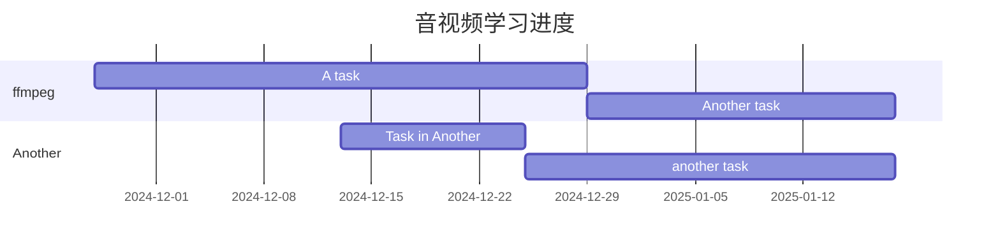

# 音视频

[TOC]



## ffmpeg

### 1.录制/播放原理


### 2.基础命令

```sh
# 播放demo
ffplay demo.mp4
# 剪辑视频
ffmpeg -i demo.mp4 -s 00:00:05 -t 00:00:20 -codec copy out.mp4
# 剥离音频和视频
ffmpeg -i demo.mp4 -acodec copy -vn out.aac
ffmpeg -i demo.mp4 -vcodec copy -an out.h264
```


### 3. YUV / RGB
